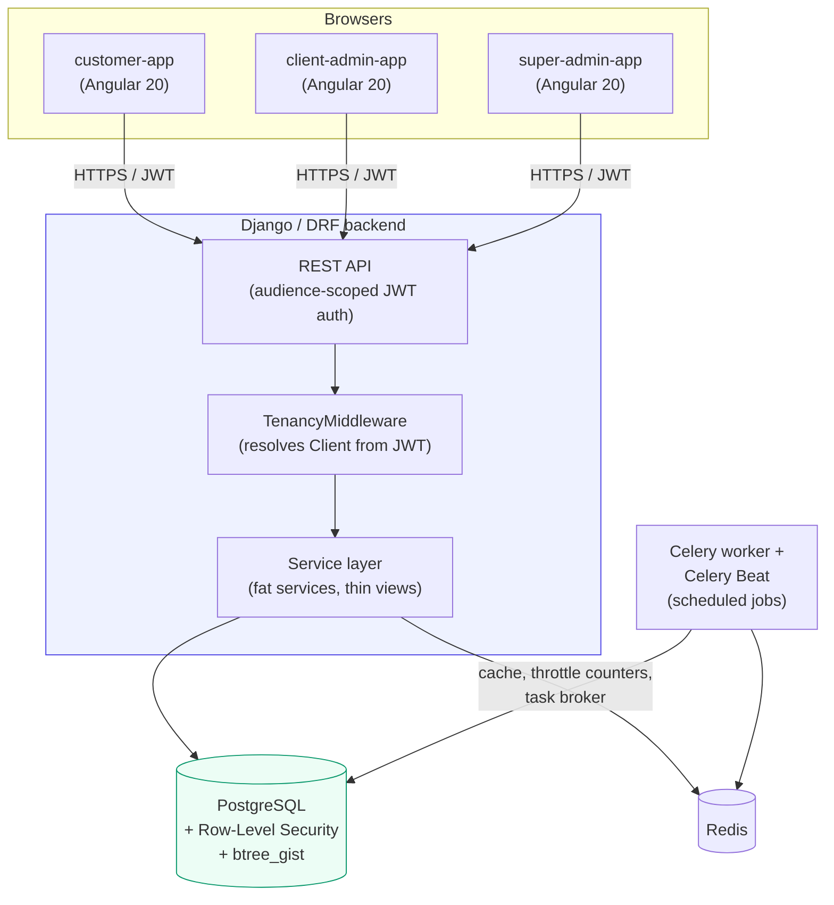
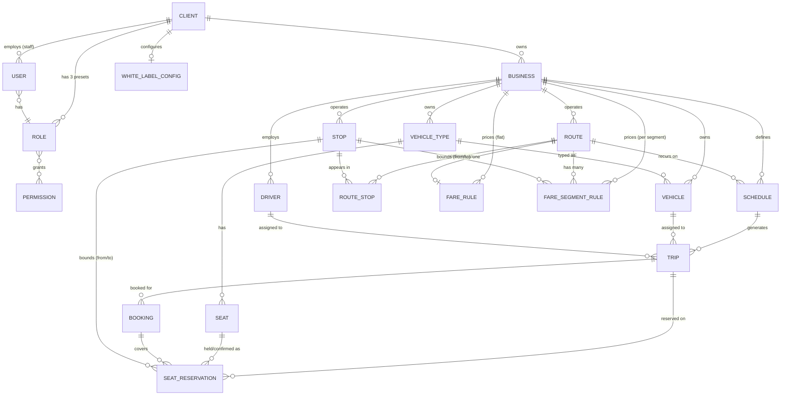

# Integra AFC — Technical Architecture

**Audience**: engineers onboarding to the project, and technical
reviewers (due diligence, security review, new senior hires) assessing
the platform's design.

**Status as of 2026-08-20**: Phases 0–9 complete and independently
self-checked (Phases 0–3) or documented via spec implementation notes
(Phases 4–9) — the full phase plan is done. This document describes
the system as it actually is today, and separately, clearly, what is
planned but not yet built. See §7 for the full built-vs-planned
breakdown, and §8 for known limitations stated plainly rather than
glossed over.

---

## 1. System overview

Integra AFC is an Automated Fare Collection platform for African
transport operators — currently modeled against a Lagos commuter
shuttle, an intercity bus operator, and a Botswana metro system as the
three reference verticals. It is built as **one Django/DRF backend
serving four white-labeled Angular 20 frontends** from a single
monorepo. A dedicated Flutter validator app is still planned for a
later phase (out of scope for everything built so far); `validator-app`
(Phase 4b, §7) is an installable Angular PWA standing in for it in the
meantime, not that future app itself.

The four frontends are not four products — they're four access
surfaces onto the same tenant-scoped backend:

| App | Who uses it | Purpose |
|---|---|---|
| `customer-app` | Passengers | **Rebuilt to the design system in spec 14 slice 5** — every screen including login, brand presence via `app-brand-mark`, a visible booking-flow step indicator, and the `consumer` surface profile actually reaching the controls (16px, so a focused input no longer makes iOS Safari zoom the page). Account, booking (trip search, seat picker, booking confirm, my-bookings — `docs/specs/4-fares-seating-booking-frontend.md`), payment (my-bookings' single Pay action → real Paystack checkout, Phase 5 frontend Slice A; the blended-payment revisit below folded the previously-separate "Pay from wallet" button into it, applying the wallet balance first and charging only the remainder, if any — and spec 14 slice 5 moved the whole thing behind a confirmation dialog carrying the amount, the wallet split as a `ui-toggle`, and a button naming the outcome, since one tap used to move money and the wallet option was a bare checkbox in a read table cell), a `credentials` screen to issue/view/revoke a Tap & Go `TapCredential` (Phase 4b frontend close-out), a ticket/QR view on paid bookings (Phase 6 frontend Slice A), and a `wallet` screen (business picker, balance, top-up) (Phase 7 Slice B) — see each phase's own spec implementation note |
| `client-admin-app` | A transport operator's own staff | Manage their Businesses, routes, fleet, schedules, trips, staff, and (Phase 5 frontend Slice B) their own payments/ledger/wallet visibility — a Payments history list, a Ledger overview (business-clearing balance + journal entries), and a passenger Wallet Lookup tool. Fares are editable both one rule at a time (`fares/new`) and, for a per-segment Business, as a whole route's stop-pair grid (`fares/fare-matrix/:routeId`, Phase 12). No settlement-run visibility (platform-staff only) — that, plus Paystack account config, is super-admin-app's own slice (below) |
| `super-admin-app` | Integra's own platform staff | **Rebuilt to the design system in spec 14 slice 6a** — all eight console screens, including `home`, which until then was the Phase 0 placeholder printing `Client: —` and `Platform staff: true`. Onboard/vet operators (KYC/KYB review), cross-client oversight, and (Phase 5 frontend Slice C) a cross-client Business search plus per-Business Paystack payout config and settlement-run trigger/history screens |
| `validator-app` | An operator's staff (conductor), tap-and-go trips only | **Rebuilt to the design system in spec 14 slice 6b**, and the one app on the `consumer` surface profile besides `customer-app` — it declared `console` until then, contradicting this spec's own "a conductor is not reading a data table". Two screens: record a board/alight tap, and validate a ticket (`docs/specs/4b-tap-and-go.md`, `docs/specs/6-ticketing.md`). Installable PWA standing in for the still-unbuilt Flutter validator app; signs in via the same client-admin JWT audience as `client-admin-app` |

**Multi-tenancy is the central design constraint.** Each transport
operator is a `Client` (the tenant). A `Client` can run multiple
`Business` entities (e.g. one operator running both a shuttle service
and an intercity route under one company). Every domain model built so
far — routes, stops, vehicles, drivers, schedules, trips — is owned by
a `Business`, and every table enforcing that ownership is protected by
**two independent layers** of isolation (§3), specifically so that a
bug in one layer cannot leak one operator's data into another's view.
This "white-label" positioning means the platform must also resolve
*which* operator a given request belongs to purely from how it was
reached (subdomain/custom domain) — see §3's white-label resolution.

---

## 2. System context (built today)

Everything in this diagram is built and running today via
`docker compose up` (Postgres with `btree_gist` enabled, Redis, the
Django backend, a Celery worker, and Celery Beat). Production AWS
provisioning is documented as an intent but not yet built — see §7.

---

## 3. Multi-tenancy & security model

This is the architectural spine of the platform, and the part a
due-diligence review should scrutinize most closely, since a fare
collection platform's entire trust model rests on one operator never
seeing another's data or money.

### 3.1 Two independent enforcement layers

1. **ORM-level (`TenantScopedManager`)** — every tenant-owned model
   inherits `core.models.BaseModel` (UUID primary key, a `client`
   foreign key, timestamps, soft delete). Its *default* manager
   (`.objects`) automatically filters every query by the active
   Client, read from a request-scoped context variable set by
   `TenancyMiddleware`. There is no "unscoped by default" manager — an
   explicit `.all_objects` manager exists for the narrow, legitimate
   cases that need to bypass scoping (super-admin cross-client review
   queues, system-context code), so any bypass is `grep`-able by name
   and, per this codebase's convention, must be individually justified
   — see §8 for the one open, non-exploitable convention gap this
   caught.
2. **Database-level (Postgres Row-Level Security)** — added in Phase 1
   as defense-in-depth, so that even a bug in the ORM layer above (a
   forgotten filter, a raw SQL query) cannot leak cross-tenant rows —
   the database itself refuses them. Every concrete `BaseModel`
   subclass's first migration applies
   `EnableRowLevelSecurity(model_name)`, which creates a Postgres
   policy scoping every row read/write to
   `current_setting('app.current_client_id')`, with an `OR` clause for
   platform-staff sessions. This is enforced structurally, not by
   convention: a registry-driven test enumerates every concrete
   `BaseModel` subclass via Django's model registry and fails
   automatically if any one skips the RLS migration operation — there
   is no allowlist to fall out of sync.

Full design record: `docs/adr/0002-tenancy-enforcement.md`.

**A real operational detail that matters for anyone connecting to the
database directly**: the application connects as `integra_app`, an
ordinary Postgres role — never as `integra`, the bootstrap/superuser
role, which unconditionally bypasses RLS regardless of
`FORCE ROW LEVEL SECURITY` (Postgres won't let anyone strip
`SUPERUSER` from a bootstrap role). Any direct `psql` access outside
of initial provisioning must use `integra_app`, or RLS will appear
enabled (`pg_class.relrowsecurity` true) while silently enforcing
nothing for that session.

### 3.2 Authentication & authorization

- **JWT, audience-scoped**: three separate token-issuing endpoints
  (`/auth/customer/token/`, `/auth/client-admin/token/`,
  `/auth/super-admin/token/`), so a token issued for one app's
  audience cannot be replayed against another.
- **Platform staff modeling**: one `User` model total (not three
  separate tables) — platform staff have a `NULL` `client` FK and
  `is_platform_staff=True`; tenant staff and passengers have a
  populated `client` FK. `docs/adr/0003` records why a single model
  was chosen over a separate `PlatformStaffUser` table.
- **RBAC**: a real, database-backed `Role → Permission` model (not
  hardcoded role checks in code). Every Client gets three fixed role
  presets at registration (Owner/Manager/Staff); every permission-gated
  endpoint uses one shared `HasPermission(codename)` DRF permission
  class. Custom/editable roles are not built yet (§7).
- **White-label domain resolution**: `GET /white-label/resolve/`
  resolves which Client owns a request purely from the browser's
  `Host` header, called once at app boot
  (`WhiteLabelResolverService`/`provideAppInitializer`) to pre-fill
  login. Production reverse-proxy topology that makes a browser's real
  custom-domain `Host` reach the backend unchanged is documented but
  not yet built — see §7/§8.

### 3.3 Audit trail

Every privileged or state-changing action (KYC/KYB decisions, staff
invitations, white-label changes, fleet/schedule/trip mutations, etc.)
writes an `AuditLog` entry via a single shared
`record_audit_event()` helper. `AuditLog` rows are append-only —
`save()`/`delete()` on an existing row raise an error by design, so the
audit trail cannot be edited after the fact, only appended to.

---

## 4. Data model (built domains)

Every box above is a real, migrated, RLS-protected table today except
`CLIENT` itself (the tenant root — RLS scopes *to* it, so it doesn't
scope *itself*) and `PERMISSION` (platform-wide, not tenant-owned, by
the same reasoning as `ClientInvitation` — see
`docs/specs/1-identity-client-business.md` §2). Full field-level
definitions live in `docs/specs/1-identity-client-business.md`,
`docs/specs/3-network-scheduling-fleet.md`, and
`docs/specs/4-fares-seating-booking.md` — this diagram is a map, not a
substitute for those.

`FareRule`/`FareSegmentRule` (Phase 4 Slice 1) are real, migrated,
RLS-protected tables — a Route uses exactly one of the two, selected at
fare-lookup time by `business.fare_pricing_mode`, never stored
per-Route (hence the "has one" / "has many" distinction above). Since
spec 15 both also carry a `trip_class` **dimension**, so "has one"
above now means one per class per instant, not one per route.

**Service classes** (`docs/specs/15-trip-classes.md`, complete) are a set
of columns rather than a table, which is why the diagram does not show
them. `Business.TripClass` — Premium / Exclusive / Standard / Mini — is
declared once and read by four apps. `VehicleType.trip_class` is what a
vehicle *is*; `Schedule.trip_class` and `Trip.trip_class` are what a
service is *sold as*; `Route.available_trip_classes` is a JSON allow-list
of what a route *may* offer, where an empty list means no restriction.
Three things about it are worth knowing before touching any of them:

- **Class is snapshotted onto the Trip from its Schedule**, never
  derived from the assigned vehicle — `Trip.vehicle` is nullable and a
  Trip is bookable long before a vehicle exists for it, so deriving it
  would leave a departure with no class until the morning it ran.
- **The fare wildcard is an empty string, not NULL.** Postgres `=` does
  not match NULL to NULL, so `trip_class WITH =` in the exclusion
  constraint would silently permit two overlapping any-class rules — the
  exact duplicate the constraint exists to prevent. `get_fare()` resolves
  the exact class first and the wildcard second, via
  `order_by("-trip_class")`, which works because any non-empty value
  sorts before `""` under DESC. That ordering is asserted by its own
  test, because "tidying" it to ascending would silently make every
  classed trip quote the wildcard price.
- **`get_fare()` inherits the wildcard; the fare matrix does not.** The
  grid filters its class exactly, so an inherited price shows as an
  empty cell rather than as a price that class owns — otherwise a save
  would supersede a rule the operator never looked at. The operator UI
  (slice 2) closes that gap by reading the wildcard grid *as well* and
  rendering its amount as the cell's **placeholder**: visible, replaced
  by typing, and never part of a save, because a placeholder is not a
  value. Anything that put it in the draft instead would make every
  inherited cell dirty on load.
- **On the passenger side (slice 3) every screen reads the class from
  its own response**, not from a value handed down the booking flow.
  Trip search reads `GET /trips/search/`, the seat picker reads the
  availability envelope, `my-bookings` and the ticket screen each read
  their own endpoint — which is why `BookingTripSerializer` and
  `TicketSerializer` both gained a read-only `trip_class`. The ticket
  screen in particular has no alternative: it is a routed path param so
  it survives a refresh, and router state does not.

`Seat`/`SeatReservation`/`Booking` are real, migrated, RLS-protected
tables — `SeatReservation` is the single table implementing
`docs/adr/0004`'s unified hold/booking concurrency model, enforced by a
Postgres GiST exclusion constraint this diagram can't express (see that
ADR and `docs/specs/4-fares-seating-booking.md` §2 for the mechanism).
`Booking`'s own creation/cancellation flow (Phase 4 Slice 3, done) is
now real too: `POST /bookings/` is the first real consumer of
`apps.core.models.IdempotencyKey` (a passenger's retried request with
the same key returns the original `Booking`, never a second one), and
`POST /bookings/{id}/cancel/` is passenger-only — client-admin staff
can see Bookings (`booking.view`) but not act on them this phase.

**Domain boundaries** (why routes/stops/fleet/schedules are separate
Django apps, not one big app): `apps/network` (Route, Stop, ordered
Route↔Stop), `apps/fleet` (VehicleType, Vehicle, Driver),
`apps/scheduling` (Schedule — a recurrence rule — and Trip — a
concrete, dated occurrence, materialized daily by a Celery Beat job
from active Schedules). This split matches the "one Django app per
bounded domain concept" convention set in `docs/adr/0001` and keeps
each app's service layer owning exactly one concern.

---

## 5. Backend architecture

- **Framework**: Django + Django REST Framework, one project,
  `apps/<domain>/` per bounded concept (`core`, `identity`, `clients`,
  `businesses`, `network`, `fleet`, `scheduling`, `fares`, `seating`,
  `booking`, `tapngo`, `ledger`, `payments`, `wallet`, `ticketing`,
  `notifications`, `analytics`, `incidents`). Two of those have **no
  models of their own** and are read layers over others — `wallet` over
  `ledger`, and `analytics` over the operational tables (spec 16). A
  domain app earns its place by owning a boundary, not by owning a
  table. `incidents` (spec 17) is the one domain with **two entry
  points into one model**: an operator queue with a status lifecycle,
  and passenger-submitted issue reports, distinguished by
  `Incident.source` and served by deliberately different serializers —
  a passenger sees status, never the internal trail.
- **Convention**: fat services, thin views — business logic lives in a
  service layer (`apps/<domain>/services.py`), views stay thin
  request/response glue. Type hints throughout, checked by `mypy` in
  CI; `ruff` for lint + format.
- **Money**: `Decimal` fields with an explicit currency field, UTC
  storage for all datetimes (`USE_TZ = True`) — first exercised in
  Phase 4 (`FareRule.amount`, `FareSegmentRule.amount`,
  `Booking.total_amount`; currency is read off the owning
  `Business.currency`, never stored redundantly per row). Phase 5
  Slice 1 (`apps/ledger`) added the double-entry ledger every later
  money movement writes through — `LedgerAccount`/`SettlementRun`/
  `JournalEntry`/`JournalLine` per `docs/adr/0006`'s account taxonomy,
  `JournalLine.amount` signed (debit/credit) so `SUM(amount) == 0` per
  entry is the balance invariant, enforced in
  `apps.ledger.services.post_journal_entry()` and independently
  re-verified by a DB-wide sweep test. **Phase 5 Slice 2
  (`apps/payments`) now actually moves money through it**: a
  `charge.success` Paystack webhook atomically posts the three-line
  entry, marks the `Booking` `paid`, and confirms its held seats. The
  commission rate itself (`INTEGRA_COMMISSION_RATE_PERCENT`) is a
  required environment variable with no code-level default — a real
  product/finance decision this codebase deliberately never guesses at.
  **Phase 5 Slice 3 closes the loop**: `apps.ledger.services.claim_settlement_run()`
  atomically creates a `SettlementRun` and bulk-claims every unclaimed
  `JournalEntry` for a Business in one period (the `settlement_run` FK
  assignment is a normal unique write, per ADR-0006, never a
  check-then-write), and `apps.payments.services.trigger_settlement_run()`
  then calls Paystack's Transfer API to actually pay the Business out —
  reconciled via a `transfer.success`/`transfer.failed` extension to the
  same webhook handler Slice 2 built.
- **`core` app**: the shared foundation every domain app builds on —
  `BaseModel`/`TenantScopedManager` (§3), the RLS migration operation,
  `IdempotencyKey` plus the generic hashing/conflict helpers in
  `apps.core.idempotency` (for safe request retries — `POST /bookings/`,
  Phase 4 Slice 3, was the first real consumer; `POST /payments/`,
  Phase 5 Slice 2, is the second), the `AuditLog` write helper, and
  health/readiness endpoints. `apps.core.rls.platform_staff_bypass()` is
  also what every `apps.ledger.services` write path runs under, and
  what the Phase 5 Slice 2 Paystack webhook handler runs under too — a
  single journal entry can legitimately span two different Clients'
  books at once (a Business's clearing account and the platform
  commission account together), and a webhook has no authenticated
  request behind it, so both were never scoped to one tenant to begin
  with. **`platform_staff_bypass()` is now re-entrant** (a
  `ContextVar`-based nesting-depth counter) — Slice 2's webhook handler
  nests it three levels deep (its own call → `post_journal_entry()`'s
  own call → `mark_booking_paid()`'s own call), and the un-guarded
  version silently broke RLS visibility for the rest of an outer bypass
  block once an inner nested call exited, caught live by the webhook
  concurrency spike, not by static review.
- **A documented DRF/tenancy gotcha that recurred and is now a fixed
  convention**: `queryset = Model.objects.all()` declared as a bare
  class attribute on a DRF generic view (or a
  `PrimaryKeyRelatedField(queryset=...)` on a serializer) is evaluated
  once at import time, before any request has set a tenancy context —
  it silently freezes to an empty queryset forever. Both view querysets
  and serializer FK fields backed by `.objects` must be resolved inside
  a method (`get_queryset()`, `validate_<field>()`), never as a class
  body expression. This bit two different slices independently before
  becoming a documented rule (`CLAUDE.md`, `docs/specs/1-...md` §2).

---

## 6. Frontend architecture

- **Angular CLI workspace** (deliberately not Nx — see
  `docs/adr/0001`'s options-considered section), Angular 20, one
  `projects/` directory: 3 application shells + 5 shared libraries.
- **Shared libraries** (each exports only through its own
  `public-api.ts`, consumed via TS path aliases — `@shared-ui`,
  `@shared-data`, `@auth`, `@layout`, `@api-client` — never deep
  relative imports across project boundaries):
  - `shared-ui` — presentational design-system components (buttons,
    text fields, status pills, tables, dialogs). Two conventions worth
    knowing: `ui-text-field`/`ui-select` render a validation error only
    when the parent binds **both** `[invalid]` and `[errorMessage]` —
    they do not read their own control's validity, so a form binding
    neither silently does nothing on an invalid submit. And
    `ui-select`'s `hint` input is the right home for guidance that is
    not inferable from the option labels: it is wired through
    `aria-describedby` (carrying both hint and error ids when invalid),
    unlike a loose `
` beside the control, which only sighted users
    get.

    Since spec 14 it also owns **the design token layer**
    (`src/theme.css`, imported by every app's `styles.css` after the
    Tailwind import) and the runtime tenant theming that overrides it
    (`lib/theme/color.ts`, `BrandThemeService`). Two rules govern edits
    there: the block is `@theme static`, not a bare `@theme`, because
    Tailwind v4 prunes theme variables whose utilities are unused and
    runtime theming needs them to exist regardless; and Tailwind's
    default palette is deliberately **not** cleared, since app templates
    still use `slate-*`/`red-*` literals until their own rebuild slice.

    Slice 2 added ten primitives — `ui-page-header`, `ui-filter-bar`,
    `ui-action-menu`, `ui-drawer` (+ `DrawerService`), `ui-skeleton`,
    `ui-tabs`, `ui-form-section`, `ui-toolbar`, `ui-density-toggle`,
    `ui-export-button`. Three conventions from them are worth knowing
    before adding more:

    - **`ui-action-menu` and `ui-export-button` emit one macrotask after
      the click**, not during it. CDK's menu fires `triggered` *before*
      it closes, so a handler that opens a dialog or drawer would
      capture a focus-restoration target that is about to be destroyed,
      leaving a keyboard user on `<body>` after every row action.
    - **The surface-profile tokens are the only source of control size
      and body type** (`--ui-control-height`, `--ui-text-body` and
      friends, switched by `data-surface` on each app's `<html>`).
      Sizing a control that repeats per table row from a fixed
      `min-h-11` sets the row height for the whole console; read the
      token instead. Compact table density is implemented as a *scoped
      override* of `--ui-control-height`, not as per-component variants.
    - **Type size comes from `--ui-text-body`, never a `text-*` class**,
      in `ui-button`, `ui-text-field`, `ui-select`, `ui-alert`,
      `ui-empty-state`, `ui-paginator` and `ui-page-header`'s
      description. This resolves to `0.875rem` in the three consoles and
      `1rem` in `customer-app`, and it is not a preference: **iOS Safari
      zooms the page whenever a focused input is under 16px**, which
      every field in the passenger app did until slice 5. Until then the
      profile was declared on all four apps and read by exactly one file,
      so it changed nothing. `lib/theme/surface-profile.spec.ts` asserts
      both directions — that the consumer profile reaches the controls,
      and that the consoles do not move.
    - **`ui-table` is the one deliberate exception**, and keeps
      `text-sm` under both profiles. A data grid is the one place
      density beats size, and the responsive-tables slice measured these
      tables' 390px fit *at 14px*; growing every cell reopens it. A
      consumer-profile app compensates in its own sub-lines (`text-sm`,
      not `text-xs`) so nothing renders below 14px.
    - **`ui-table`'s `stickyHeader` requires `maxHeight`**, and that is a
      consequence rather than a preference: the wrapper is
      `overflow-x-auto`, CSS forces the other axis to `auto` too, so a
      sticky `<th>` sticks to *the wrapper* — which never scrolls
      vertically without a height, making the header compile and visibly
      do nothing.
    - **`ui-table` hides columns by tier, and owns its cells' horizontal
      padding.** Every table in the workspace overflowed a 390px
      viewport, so a row's only control needed a sideways scroll to
      reach. Secondary columns take `hidden md:table-cell`, the long
      tail `hidden lg:table-cell`, and their values re-flow into a
      `md:hidden` sub-line under the primary cell — a narrow row loses
      columns, not information. Three rules: never hide a column
      containing a control; put the visibility class on the `<th>`, its
      `<td>` **and** the skeleton `<td>` (missing one shifts every later
      value under the wrong heading, silently); and never set `px-*` on
      a cell, because the component shrinks that padding on a phone and
      three columns of `px-4` were themselves most of the overflow.
      Guarded twice: `expectColumnVisibilityParity` (`@shared-ui`) in
      every list spec, and `e2e/responsive-tables.ts`, which measures
      the result at 390/768/1200 because a media query only resolves at
      a real viewport. **Neither guard measures legibility** — a table
      with seven columns all at the `md` tier passes both while wrapping
      every cell to five lines and pushing the row's control off the
      edge, which is what reading the screenshots is for. A table with
      more than about five columns needs all three tiers, not two.
      **`overflow-wrap: anywhere` applies to `td` only**; a `th` gets
      `break-word`. A heading is a short, known string the app chose,
      and breaking it mid-word rendered "VERTIC AL" and "DOCUMEN TS" in
      the KYB queue. That rule has now needed two carve-outs — this and
      `:is(button, a)` — both from aiming at long *data* and hitting the
      whole table. The scroll container is a labelled
      `role="region"` tab stop — it scrolls, and a scrollable region
      with no focusable content cannot be scrolled by keyboard.
    - **`ui-alert`'s role follows its variant** — `alert` for `error`,
      `status` for `success` and `warning`. `alert` is an assertive live
      region: it interrupts a screen reader mid-sentence, which is right
      for a failure and wrong for "Saved." or for the static guidance
      several screens render through this component.
    - **A `ui-form-section` title must not be, or contain, the label of a
      field inside it.** It renders a real `<section aria-labelledby>`,
      so a section titled "Domain" wrapping a field labelled "Domain"
      gives a screen-reader user the same word twice and makes the
      control ambiguous — three sections collided this way when slice 4
      landed, and `getByLabel` found two elements for each.
    - **`ui-text-field` and `ui-select` both take `hint`**, wired through
      `aria-describedby` and carrying both hint and error ids when
      invalid. Use it for guidance not inferable from the label — a
      format, a unit, that a field is optional — rather than a loose
      `
` beside the control, which only sighted users get.
    - **`ui-action-menu` is icon-only unless given `triggerLabel`.** In a
      table row that is right; standing alone it is not — the shell's
      quick-create control shipped as a bare "…" that told sighted users
      nothing while announcing correctly to a screen reader.
    - **`ui-filter-bar` takes `showSearch`, and a list whose endpoint has
      no free-text filter must set it `false`.** A search box that
      silently ignores what is typed into it is worse than none; the
      pay-as-you-go screen shipped exactly that for one iteration.
    - **`ui-toolbar` is a labelled `group`, not `role="toolbar"`**, and
      the same reasoning applies to any new container: that role owns a
      roving arrow-key focus contract that projected content cannot
      honour, and a role promising a navigation model that does not work
      is worse than no role. `ui-tabs` does implement the full tabs
      pattern, with its key handler on the tabs rather than the
      (unfocusable) tablist. **`ui-radio-group` sidesteps the question
      by using native `<input type="radio">` sharing a `name`**, which
      is where arrow-key selection and single-tab-stop behaviour come
      from for free — including in its **`segmented`** variant, where the
      inputs are `sr-only` (never `hidden`, which would take them off the
      tab order) and their labels carry the styling. That variant exists
      because `validator-app`'s board/alight switch was a
      `role="radiogroup"` div wrapping two `ui-button`s with
      `aria-pressed`: a radio group to a screen reader, two independent
      toggles in fact. Use it where the choice is binary and target size
      matters more than vertical space. **A `sr-only` input cannot be
      clicked at the input** — the label covering it intercepts the
      pointer, which is correct, so a test clicks the label.
    - **`ui-textarea`, `ui-radio-group` and `ui-checkbox` exist because
      seven screens hand-rolled them and three still carried
      `border-slate-300`** — the 1.48:1 input border slice 1 replaced
      everywhere else, which axe cannot see. The border is the
      measurable half; the rest is that a hand-rolled control has no
      reliable label association, no `aria-describedby`, and **no way to
      render an error**, so a server error on a textarea or a boolean
      had nowhere to go. All three take `ui-text-field`'s contract
      exactly, so `form-errors` works on them with no special case.
    - **`ui-checkbox` is not `ui-toggle`, and the split is deliberate.**
      `ui-toggle` is intentionally *not* a `ControlValueAccessor` — it
      fires and expects an immediate write. `ui-checkbox` is a form
      value committed on submit. Both put the 44px target on the label
      row rather than the 16px box (WCAG 2.5.8).
    - **`ui-page-header` has a `breadcrumb` slot.** It shipped in slice 2
      and had no consumer until 6a, while three screens hand-rolled a
      `← Businesses` link above their own `<h1>`.
  - **`customer-app`'s own two components**, local rather than in
    `@shared-ui` because no console has a second use for either:
    `app-brand-mark` (the operator's `logo`, else their `name`, else
    ours — the first consumer anywhere of the white-label response's
    non-colour half, which until slice 5 was read by nothing at all,
    despite tenant branding being one of this spec's founding findings)
    and `app-booking-steps` (search → seats → confirm). **Payment is
    deliberately not a fourth step**: it happens later from
    `my-bookings`, often in another session, and drawing it would
    promise a screen the flow never reaches.
  - **A seat map must sort the seats it is given.**
    `apps.seating.services.get_availability` reads `Seat.objects` with
    no `order_by`, so it inherits `Seat.Meta.ordering = ["-created_at"]`
    and serves the map **newest first** — a bus rendered 3B, 3A, 2B, 2A,
    1B, 1A. This is the same trap spec 10 recorded and fixed for
    quick-book seat *allocation*; the map a passenger looks at was never
    checked. `seat-picker` sorts (with `Intl.Collator({numeric: true})`,
    so 10A follows 9A rather than 1A), and `splitAtAisleGaps`' stated
    precondition — "already sorted by column" — is therefore true only
    because the caller makes it so. **The missing `order_by` is still
    the root cause**, unfixed.
  - **`@shared-ui`'s `ui-chart`** is the only place any chart is drawn,
    and it draws **inline SVG with no charting dependency** (spec 16
    slice 3). Two reasons, both specific to this system: a canvas
    `fillStyle` cannot hold `var(--color-brand-600)`, so a white-labelled
    tenant's chart colours would have to be resolved with
    `getComputedStyle` at draw time and re-resolved every time
    `BrandThemeService` rewrites the ramp; and the drawing is decorative
    anyway, because every chart renders a visually-hidden data table
    beside its `aria-hidden` `<svg>` — a canvas is opaque to assistive
    technology, so that table is mandatory, and once it exists the
    picture carries no information of its own. Two geometry rules the
    component records rather than re-derives: the plot is stretched
    non-uniformly, so **nothing inside it may rely on geometry** (a
    point marker is a zero-length round-capped line, not a `<circle>`,
    which rendered as a 20×6 ellipse) and **no text is drawn inside
    it** (axis labels are real HTML around the SVG). A `null` point is
    a gap, never a zero.
  - **`@shared-ui`'s `formatMoney`** is the single money format for all
    four apps (`"NGN 1500.00"`). Amounts stay decimal **strings** end to
    end and it must never take a `number`; arithmetic on them is
    `customer-app`'s `multiplyDecimal`, which is seat-fare maths. Before
    it moved here, `customer-app` held the original, `client-admin-app`
    kept a copy whose comment said it was local *because* the helper was
    not in a shared library, and `validator-app` interpolated the two
    values by hand in the opposite order.
  - **`@shared-ui`'s `form-errors.ts`** is the single way a
    form turns control state into the sentence under a field, and the
    single way a DRF error body reaches those fields. It lived in
    `client-admin-app` until `customer-app` needed it too.
    `fieldErrorMessage(control)` reads the error that actually failed —
    it replaced seventeen hand-written copies, twelve of which said
    "This field is required." whatever had gone wrong.
    `applyServerErrors(form, error, fallback)` sets each `{field: [msg]}`
    on its own control and **returns whatever could not be placed** for
    the page-level alert; a field error with nowhere to go must still
    reach the user. Two traps recorded there: `setErrors` does not
    survive a control being bound to a `formControlName` directive
    (Angular re-runs validators and replaces `errors`), so the message
    is held in a `WeakMap` beside the control; **a form-level error is
    invisible to `fieldErrorMessage`**, which reads control-level errors
    only — three password-confirmation forms carry `passwordMismatch` on
    the group and must check it explicitly, or migrating them drops that
    message silently while every test still passes; and a control with no
    field on screen — every client-admin record form carries `business`
    that way — must be named in the `unplaceable` option or its message
    is set somewhere invisible. **The library holds no opinion about
    which names those are**; an app with a standing answer wraps the
    function rather than repeating itself at every call site, which is
    what `client-admin-app/src/app/shared/form-errors.ts` now is. Making
    it an argument alone would be worse: nine forms depend on it, and a
    tenth that forgets swallows the message silently.
  - `shared-data` — `ListStore<T extends {id: string}, TQuery>`, the
    base class every paginated domain list screen extends
    (signals-based, handles `getAll()`/`updateQuery()`/`changePage()`),
    plus `findByIdPaged()` — the single lookup every detail/edit screen
    must use to resolve a record by id. It pages rather than trusting
    one bounded page, and deliberately never touches `state`, so a
    detail-screen lookup cannot clobber the list screen's pagination.
  - `auth` — `AuthStore`, audience-scoped `AuthApiService`,
    `PermissionsService`, the `permissionGuard` route guard, and the
    white-label domain resolver.
  - `layout` — `NavShell`/`AuthLayout` app-shell primitives, plus
    `NotificationBell`, `ForbiddenPage` and `BrandMark` (the operator's
    logo, else their name, else ours — used on `customer-app`'s,
    `client-admin-app`'s and `validator-app`'s logins and headers, and
    deliberately **not** on `super-admin-app`, which spans every Client
    and so has no tenant whose mark it could wear). **Tokenised in spec 14 slice
    6a**, which is later than it sounds: no earlier slice owned this
    library, so the chrome on every `client-admin-app` and
    `super-admin-app` screen stayed on `slate-*` literals through five
    slices of rebuilding the screens inside it. `NavShell`'s active nav
    item is `primary-subtle`, so a white-labelled tenant's brand
    finally reaches the console chrome rather than stopping at the
    content area. An unread notification carries a dot and an `sr-only`
    "Unread." — it was a `bg-slate-50` tint and nothing else, which is
    colour as the only status indicator and gave a screen-reader user
    no signal at all.
  - `api-client` — a fully-typed REST client generated from the
    backend's OpenAPI schema (`npm run openapi:generate`), with a
    drift check (`openapi:check`) wired into the workflow so the
    frontend's types can never silently diverge from the backend's
    actual contract.
- **Conventions**: standalone components (implicit in v20, no
  `standalone: true` boilerplate), `input()`/`output()` signal
  functions rather than `@Input()`/`@Output()` decorators,
  `ChangeDetectionStrategy.OnPush` on every component, native control
  flow (`@if`/`@for`), reactive forms by default (a small number of
  deliberate, documented exceptions use `ngModel` where a shared
  control has no native `(change)` output), Tailwind CSS first with
  CDK `Dialog`/`BreakpointObserver` for overlays and responsive
  behavior. No NgRx, no Angular Material — verified by grep in every
  phase's self-check, zero exceptions found to date.
- **Permissions in the UI**: a `*appHasPermission` structural directive
  and `permissionGuard` both read the same `/me` permissions array the
  backend RBAC model produces, so frontend visibility and backend
  authorization are driven by one source of truth, not duplicated
  logic.

---

## 7. What's built vs. planned

| Phase | Scope | Status |
|---|---|---|
| **Phase 0 — Foundation** | Monorepo scaffold, Docker Compose, CI, Django tenancy skeleton, audience-scoped JWT auth, Angular workspace (3 apps + shared libs), login→home vertical slice, Playwright + axe | **Complete**, self-checked (`docs/self-check-2026-08-07.md`) |
| **Phase 1 — Identity, Client, Business** | Postgres RLS (defense-in-depth), Client self-registration + KYC, Business + KYB, DB-backed RBAC (Role/Permission/StaffInvitation), white-label config + subdomain resolution | **Complete**, self-checked (`docs/self-check-2026-08-08.md`) |
| **Phase 2 — Client-Admin + Super-Admin UI** | Nav shell, Business management UI, staff management + invite, KYC/KYB review-queue UI, white-label config UI, super-admin client-invitation UI | **Complete**, self-checked (`docs/self-check-2026-08-08-phase2.md`) |
| **Phase 3 — Network, Scheduling, Fleet** | Route/Stop/RouteStop, VehicleType/Vehicle/Driver, Schedule/Trip + the Trip state machine + daily Celery Beat trip-generation job, full `client-admin-app` UI for all 7 models | **Complete**, self-checked (`docs/self-check-2026-08-09-phase3.md`) |
| **Phase 4 — Fares, Seating, Booking** | Fare rules, per-seat layouts, segment-aware seat availability, the booking engine (the revenue path) | **Backend and frontend both complete**, self-checked (`docs/self-check-2026-08-14-phase4-frontend.md`) — `apps/fares`, `apps/seating` (the ADR-0004 concurrency spike, now **Accepted**), `apps/booking`'s creation/cancellation flow, plus the `docs/specs/4-fares-seating-booking-frontend.md` addendum (customer-app booking flow, client-admin bookings-list) and a separately-documented fare-versioning/price-snapshot feature (`docs/specs/4-fares-seating-booking-versioning.md`). 346/346 tests passing. The frontend addendum and the versioning feature were both built without the working agreement's stop-and-review checkpoints and verified retroactively — see the self-check for the full account |
| **Phase 4b — Tap-and-go fare determination** | Board/alight tap recording + segment-fare pricing for non-reservation operators (e.g. Botswana metro), stopping short of payment collection | **Fully complete** — backend, operator harness, customer-app credential UI, and a permanent E2E spec are all built, spec'd at `docs/specs/4b-tap-and-go.md` (see its four Implementation notes) — `apps/tapngo` (`TapCredential`/`FareJourney`/`TapEvent`), identification via QR or NFC through one opaque revocable token, pricing reuses `apps.fares.services.get_fare()` unchanged, one-open-journey-per-passenger enforced by a Postgres partial unique index and proven under real concurrency. 383/383 backend tests passing. The harness shipped as `validator-app`, a fourth installable-PWA Angular app (§2), not the unstyled page originally scoped — verified end to end against the real backend, catching a real CORS gap and a real shared-`ui-button` accessibility bug along the way. The customer-app credential UI needed no backend change — this workspace's first QR-rendering code. The permanent `frontend/e2e/validator-app/` Playwright spec, the last remaining piece, needed a new `playwright.config.ts` entry and a `seed_e2e_users` extension (its own tap-and-go-mode Business, since `booking_mode` is snapshotted per-Trip from the Business's default, plus a `TapCredential` seeded with a known fixed token since the real issuance flow never persists one) — see the spec's own note for 4 pre-existing, unrelated full-suite failures this surfaced, traced to this dev database's already-documented Business-list cruft, not caused by this work |
| **Phase 5 — Payments, Wallet, Ledger** | Payment provider integration, passenger wallets, double-entry ledger, operator payouts | **Backend complete** (all 3 slices, 470/470 backend tests) — `docs/specs/5-payments-wallet-ledger.md`. Slice 1: `apps/ledger` (`LedgerAccount`/`SettlementRun`/`JournalEntry`/`JournalLine` per `docs/adr/0006`'s taxonomy, `post_journal_entry()` as the sole balanced-write path). Slice 2: `apps/payments` (Paystack payment initiation + webhook, per `docs/adr/0007`) and `apps/wallet`, plus `Booking.Status.PAID` — a passenger can now pay for a booking end to end. Slice 3: `claim_settlement_run()`/`trigger_settlement_run()` + a `transfer.success`/`transfer.failed` webhook extension — platform staff can now trigger a real Paystack payout of a Business's accumulated balance. **Frontend complete, all 3 slices** — Slice A (customer-app's "Pay now" flow on `my-bookings`), Slice B (client-admin-app's Payments/Ledger/Wallet Lookup visibility screens, plus a new `ui-stat` shared component), and Slice C (super-admin-app's Business search + Paystack account config + settlement-run trigger/history screens, which needed two small backend additions — `GET /super-admin/businesses/` and a `GET` on the previously PATCH-only Paystack account config endpoint) are all done, see the spec's own implementation notes. **This closes Phase 5's frontend arc.** 480/480 backend tests passing |
| **Phase 6 — Ticketing** | QR ticket issuance, offline validation support | **Complete — backend and both frontend slices** — `docs/specs/6-ticketing.md`. Slice 1: `apps/ticketing`'s `Ticket` model (`OneToOneField` to `SeatReservation`, not `Booking` — a Booking can hold several seats), `signing.py` (this backend's first crypto dependencies, `cbor2`/`pynacl`), `issue_ticket()` wired into `mark_booking_paid()`, 3 `GET` read endpoints. Slice 2: `validate_ticket()` (mirrors `apps.tapngo.services.record_tap()`'s idempotency-first, typed-exception shape), `POST /trips/{id}/tickets/validate/`, new `ticketing.validate` permission. 511/511 backend tests passing (up from 480). Slice 1 surfaced a pre-existing, unrelated defect — every bare, no-default `config()` secret in `config/settings/base.py` looks like it would crash Django settings import under real CI — flagged, not fixed. Slice 2's own mandatory concurrency test caught a real race (two requests under the identical Idempotency-Key could both see the ticket as already-boarded and one would wrongly self-reject instead of recognizing its own replay) — fixed with a race-free second `IdempotencyKey` lookup taken after the row lock. **Frontend Slice A** (customer-app): `my-bookings` gained a "View tickets" action on `paid` rows opening a new `my-bookings/:id/tickets` screen (this workspace's first routed path param) rendering one QR per Ticket via the same `toDataURL()` call `credentials` already established; no backend change needed. 93/93 `customer-app` Karma tests passing (up from 86). **Frontend Slice B** (validator-app): a second screen mirroring `record-tap`'s component/service split exactly, its trip picker filtering to the *opposite* `booking_mode` (`!== 'tap_and_go'`) since only reservation-mode trips produce Tickets, no stop picker needed (a ticket's stop pair is already in the signed payload). Found and closed a real design gap along the way: `AppShell` had no navigation at all (justified when the app had "exactly one screen," no longer true with a second route) — fixed with two plain `routerLink` text links in the existing bespoke header. 31/31 `validator-app` Karma tests passing (up from 20). Verifying both frontend slices live surfaced a real environment gap (not fixed): `docker compose build backend` times out in this sandbox on `pynacl`/`django-celery-beat`'s wheels, so the backend Docker image still predates Phase 6's crypto deps — verified instead via `uv run python manage.py runserver` directly against the running `postgres`/`redis` containers plus real HTTP round-trips (Slice B: a real Ticket boarded, a same-key replay returning the identical result, a different-key replay correctly 409ing). See the spec's own Implementation notes for all three slices |
| **Phase 7 — Passenger Wallet** | Wallet top-up via Paystack, pay-a-booking-from-wallet | **Complete — both slices**, `docs/specs/7-passenger-wallet.md`. Slice A (backend): `PaymentIntent` gained `intent_type` (`booking_payment`/`wallet_topup`) and a `wallet_business` FK (XOR'd against `booking` by a `CheckConstraint`); `initiate_wallet_topup()` mirrors `initiate_payment()`'s idempotency/Paystack shape; `pay_booking_from_wallet()` locks the `Booking` row before checking wallet balance, posts a 3-line ledger entry, and calls `mark_booking_paid()` — a second, independent path to `PAID` alongside the card/webhook path. Its own mandatory concurrency spike (8 threads racing a shared wallet balance; a wallet-pay vs. webhook race for the same booking) found a real bug: `mark_booking_paid()` returned just `Booking`, so callers inferred "did I just pay this?" from `status == PAID` alone — indistinguishable from "a rival path paid it first." Fixed by changing its return type to `tuple[Booking, bool]` (`did_transition`). 470/470 backend tests passing before this phase, up to date after. Slice B (customer-app): a new `wallet` screen (business picker sourced from `GET /routes/browse/`, balance, top-up) and a balance-gated "Pay from wallet" action on `my-bookings`. 117/117 `customer-app` Karma tests passing (up from 107). Live-verified against a real booking and a directly-funded wallet: balance displayed correctly, top-up correctly surfaced Paystack's real 401 (Paystack unreachable in this dev sandbox), pay-from-wallet correctly moved a real ledger balance ₦1000.00 → ₦250.00 matching the booking's exact total. **Blended wallet + Paystack payment, revisiting this spec's own original "split/partial payment" non-goal, built 2026-08-23**: the non-goal's stated blocker (a mid-flight-failure reconciliation gap) is resolved by charging Paystack first, for the remainder only, and debiting the wallet only inside the same atomic step that confirms the webhook and marks the booking paid — never a window where the wallet's debited but nothing's purchased. `PaymentIntent.wallet_component_amount` (new field) carries the split; `initiate_payment_with_wallet()` delegates to `pay_booking_from_wallet()` when the wallet covers everything, otherwise charges Paystack for the remainder and settles the wallet debit at webhook time via a new 4-line entry in `_apply_booking_payment()`; a balance-shortfall-at-settlement edge case reuses the existing `requires_manual_refund` escape hatch rather than building new refund machinery, an explicit choice made with the user up front. The old standalone `POST /bookings/{id}/pay-from-wallet/` endpoint is removed — `POST /payments/`'s `use_wallet_balance` flag is its full replacement. `my-bookings`' two buttons became one ("Pay now" + a wallet-balance checkbox with a live breakdown preview), per an explicit decision to unify. 574/574 backend tests passing (up from 565); full 4-app frontend build and Karma suite green. Live-verified all three payment shapes (plain Paystack, wallet-only, blended) against the real backend — see `docs/specs/7-passenger-wallet.md`'s own implementation note for the full account, including one real pre-existing bug found and named but not fixed (an already-departed seeded trip's `Ticket.expires_at` can land before its own `issued_at`, unrelated to this feature). **Cross-cutting fix, same day**: re-verifying this flow surfaced a real, unrelated data-integrity gap — `Business.currency` (`apps/businesses/models.py`, dating to Phase 1) was a bare `CharField` with no format validation; one live Business had `currency="Naira"` instead of `"NGN"`, which passed every check in this app and only failed once `apps.payments.psp.paystack` sent it on to Paystack's `/transaction/initialize`, which rejected it with a 400 that this backend correctly maps to a 502. Fixed the bad row directly and closed the gap with a `RegexValidator` requiring a 3-letter ISO 4217 code — deliberately a format check, not a hardcoded currency allowlist, since `docs/adr/0007` already names a second, non-NGN currency (Botswana's BWP) as a tracked future gap. One new test (`test_currency_must_be_a_3_letter_iso_4217_code`) proves the exact bad value is now a 400 at creation time. 575/575 backend tests passing (up from 574) |
| **Phase 8 — Seat map generation** | Rows × columns (+ optional aisle) seat-layout generator, closing the "no seat map builder UI at all" gap `PUT /vehicle-types/{id}/seats/` has had since Phase 4 | **Complete — both slices**, `docs/specs/8-seat-map-generation.md`. Slice A: `apps.seating.services.generate_seat_layout()` and `replace_vehicle_type_seats()` changed to take `seats: list[SeatSpec]` and write real `row`/`column` geometry (previously always `null`, despite `customer-app`'s `seat-picker.ts` already being written to render it); new `POST /vehicle-types/{id}/seats/generate/`; a real pre-existing gap fixed — regenerating seats with active `SeatReservation`s used to raise an unhandled 500, now a typed `409 SeatsInUse`. Slice B: a new `client-admin-app` `vehicle-types/:id/seats` screen (client-side-only preview, real write only on submit) and `seat-picker.ts`'s aisle-gap rendering. The aisle model changed mid-Slice-B, by deliberate choice: Slice A's numbering-only aisle (no column gap) couldn't actually drive Edge case §5's gap-rendering mechanism, so it was revised to a physical-layout model where the stored `column` integer jumps by 2 across the aisle — Slice A's own tests were updated to match. A second real bug was found and fixed independent of that: `VehicleTypeSeatsView`/`VehicleTypeSeatsGenerateView` had always been schema-documented as paginated (`DEFAULT_PAGINATION_CLASS` applying to any `GenericAPIView` by default) despite always returning a bare array — invisible until this slice's screen became the first real consumer and the generated frontend types didn't match; fixed with `pagination_class = None` on both views. No model/migration change. 540/540 backend tests, 278/278 `client-admin-app` and 118/118 `customer-app` Karma tests passing, `ng lint`/`ng build` clean on both apps. Live-verified end to end against the real backend, including confirming the real column-gap data via a direct call to the exact endpoint `seat-picker.ts` consumes |
| **Phase 9 — In-app notifications** | A `Notification` model, a scheduled compliance-expiry sweep, an event-driven unused-ticket reminder, and a shared bell-icon UI across all 4 frontends | **Complete — both slices**, `docs/specs/9-notifications.md`. Slice A: new `apps/notifications` app (`Notification`, RLS-protected). Two resolved design questions changed the spec's original draft: (1) the license/insurance/roadworthiness sweep re-nags every `LICENSE_EXPIRY_RENOTIFY_DAYS` (7) days while unresolved and starts a fresh cycle immediately on a renewal, instead of firing once per target ever — needed two new fields (`expiry_snapshot`, `notified_for_date`) and a changed uniqueness constraint; the ticket-unused-reminder sweep keeps the original fire-once design since a Ticket's own status naturally resolves it. (2) A third trigger was added for `super-admin-app`: every platform-staff user is notified the moment a KYC/KYB document is submitted — event-driven, called directly from `apps.clients.services.submit_kyc_document`/`apps.businesses.services.submit_kyb_document`. This surfaced a real modeling question (platform staff have no Client of their own) resolved by keeping `Notification.client` non-nullable but pointing at the *submitting* Client, not the recipient's — which in turn means `GET /notifications/mine/`/`POST .../read/` branch on `request.user.is_platform_staff` (`.objects` vs `.all_objects`), verified safe against RLS's own `client_id = session OR is_platform_staff` policy rather than assumed. Two Celery Beat sweep jobs + two internal-task HTTP endpoints/GitHub Actions cron workflows, mirroring `generate_trips`/`expire_seat_holds`'s exact shape. Slice B: a shared `NotificationBell` (`@layout`) reusing `NavShell`'s own dropdown mechanics (no CDK Overlay exists anywhere in this workspace); a `resolveRoute` per-app customization point resolving three real routing gaps found before building (`customer-app`'s Ticket and `super-admin-app`'s KycDocument/KybDocument only resolve to a general list, no deep link exists for either; `validator-app` gets no resolver at all, mark-read-only). A real bug was found only by opening it in a real browser inside `NavShell`'s narrow sidebar: the dropdown panel rendered off the left edge of the viewport (a `right-0` anchor works fine in the two wide bespoke headers but not the narrow sidebar) — fixed with a new `align` input, verified by screenshot and locked in with a test. 565/565 backend tests passing (up from 540); `layout`/`shared-ui`/all 4 apps' Karma suites green. Live-verified all three trigger types end to end through the real UI, one full round trip per type |
| **Flutter validator app** | Offline-capable ticket validation on operator devices | **Not started.** Explicitly out of scope until its own later phase |
| **Phase 10 — Booking modes** | `open_seating`, Tap & Go as universal fare media, pay-as-you-go rename | **Complete — all 4 slices** — `docs/specs/10-booking-modes.md` (see its four Implementation notes) and `docs/ui-review/10-booking-modes/`. Splits today's single `booking_mode` enum, which conflated three independent questions (what you buy, how you're identified at boarding, when you pay), into orthogonal axes: `booking_mode` (`reservation`\|`open_seating`), `seat_selection_enabled`, `capacity_enforced`, and a new `fare_collection_mode` (`prepaid`\|`pay_as_you_go`). **Slice 1** landed the model, the data backfill and every behavioural gate. **Slice 2** landed open-seating booking (`passenger_count`, nullable `Booking.from_stop`/`to_stop`), seatless `Ticket`s (`seat_reservation` nullable, `passenger_index`, `segment_range`, `ticket_id` as the signed payload's lookup key — ADR-0005 amended), the availability **envelope** (`{booking_mode, status, seats, capacity_remaining}`, fixing a real pre-existing defect where a vehicle-less trip rendered identically to a sold-out one), and `apps/ticketing/capacity.py`. A product decision superseded ADR-0008 mid-slice: capacity counts **issued tickets only**, so an oversold departure is detected and remedied commercially rather than prevented — the `Trip` row lock's job moved from prevention to a consistent count plus a `trip.oversold` audit record per crossing. That remedy has **no code path yet** (no refund service; `apps/wallet/services.py` is read-only) — its own slice. **Slice 3** made the credential universal: presenting a `TapCredential` on a prepaid trip boards the `Ticket` the passenger already holds, via `POST /trips/{id}/tickets/validate/` taking either `payload` or `token`; one tap boards one ticket, oldest first, so a group booking stays boardable; a credential with no ticket 404s and a PAYG trip 400s, both asserting **no `FareJourney` is opened**. `validator-app`'s `record-tap` became the one scan screen, branching on the selected trip's `fare_collection_mode`. It also fixed a real pre-existing bug both validator screens carried: `selectedTrip` was a `computed` over a plain form-control value, depending on no signal, so it cached "nothing selected" forever and the trip-detail line had never rendered. **Slice 4** built the frontend and, on an explicit decision rather than silently, the **quick book** behaviour the spec had only asked a control for: `seat_selection_enabled` was stored from slice 1 and read by no code anywhere, so shipping just the switch would have let an operator turn seat choice off and watch nothing happen — the same "writable field with no behaviour" defect spec 12 existed to fix. `POST /bookings/` now takes `passenger_count` on a reservation trip whose Business has seat choice off and allocates free seats server-side (read live off the Business, not snapshotted — it describes how a seat is picked, not what was sold); the availability envelope gained `seat_selection_enabled`, which is *not* the Business field of that name (always false for open seating, which has no seats to pick). `seat-picker` branches on the envelope rather than on an empty seat list, `BookingRequest` became a discriminated union so "both" and "neither" are unrepresentable, super-admin's seat-hold screen says when the setting is inert, and the fare model — not the credential — was renamed to **Pay as you go** across the client-admin UI. Its visual pass found two real defects: a switch whose explanation was a loose `
` unreachable by screen readers (`ui-toggle` gained `describedBy`), and a confirm screen promising that open-seating places are "held", which is false. One pre-existing defect is recorded and unfixed: `customer-app`'s nav collapses and overflows at 390px, the authoritative passenger viewport. 690/690 backend tests passing (up from 383 pre-phase) |
| **Phase 11 — KYB directors** | Structured director records and a real KYB form | **Complete**, self-checked (`docs/self-check-2026-08-26-spec11.md`, `docs/ui-review/11-kyb-directors/`) — `docs/specs/11-kyb-directors.md`. New `businesses.Director` (RLS-protected) plus a nullable `KybDocument.director` FK, replacing the old KYB UI — one undifferentiated document-type `<select>` and file input appended below the business edit form, with nowhere to record director identity at all. Additive migrations only. Read gate is `client.view`, not a `business.view` (no such codename exists; `apps/businesses` has only a write codename, and `BusinessListCreateView` already branches per-method to `client.view`). Two backend additions the spec did not anticipate: `KybDocumentUploadView` gained a `GET` (it was POST-only, so client-admin could never read back what it had already supplied — and it needs `pagination_class = None`, or drf-spectacular documents a bare list as a paginated envelope and the generated types stop matching the endpoint), and both review queues now `order_by` submission time rather than inheriting `-created_at`, so a business registered long ago but submitted today no longer sinks below everything created after it. `ui-button` gained an `ariaLabel` passthrough for the same `display: contents` reason `ariaPressed` documents — this screen has six buttons all named "Upload". **The self-check's §10.6 visual loop found two High-severity defects that the unit and e2e suites had both passed over**: the screen resolved its business from one bounded 25-row page (so any business past row 25 rendered "couldn't be found" — fixed with `BusinessStore.findById()`, the third instance of that family in this codebase), and the add-director form rendered no validation feedback at all, because `ui-text-field`/`ui-select` show errors only when the parent binds `[invalid]`/`[errorMessage]`. 609/609 backend tests (1 unrelated pre-existing failure); client-admin 295, super-admin 67 Karma; super-admin e2e 16/16 |
| **Phase 12 — Fare matrix** | Stop-pair fare grid editor | **Backend and frontend both complete**, self-checked — `docs/specs/12-fare-matrix.md` (both Implementation notes), `docs/ui-review/12-fare-matrix/`. **No data model change**: per-stop-pair pricing already existed end to end (`fares.FareSegmentRule`, Phase 4) and was simply unreachable. Closed both defects — `business-form` gained a **Fare pricing mode** select (which also un-deads `fare-form`'s `@if (isPerSegment())` branch), and `GET`/`PUT /routes/{id}/fare-matrix/` plus a new `fares/fare-matrix/:routeId` grid screen replaced 45 separate create flows with one editable matrix. The load-bearing rule: `apps/fares/matrix.py` orchestrates and **never writes** — every mutation goes through `apps/fares/services.py`, which owns the versioning, so the price snapshot a historical `SeatReservation` points at survives. One new service function, `close_fare_segment_rule()` (close with no successor = stop selling the segment, not a delete). The grid submits **only edited cells**, so a stale blank for an untouched cell can never close a rule another operator created mid-edit. 631 backend tests passing; 0 axe violations across six measured states |
| **Client-admin UX hardening — Slice 1** | Constrained inputs, inline activate/deactivate, implicit business scoping | **Complete (Slice 1 of a larger batch).** Backend: `Business.currency` moved from a `RegexValidator` (format only — `GBP` still saved cleanly and only failed at Paystack) to a real `Currency` choice list, and `Business.timezone` gained `validate_iana_timezone` — it was previously a bare `CharField(64)` with **no** validation at all, so a typo like `Africa/Lagoss` saved fine and only surfaced much later as a `ZoneInfoNotFoundError` inside trip generation or settlement-period arithmetic. `BWP` stays selectable despite Paystack not serving Botswana, per `docs/adr/0007`'s explicit "named open gap" decision — the UI labels it rather than hiding it. `GET /trips/` gained the `?business=` param every sibling list endpoint already had; its absence was why client-admin's Trip list was the one screen still showing every Business's rows. Frontend: new `ui-toggle` (`role="switch"`, aria on the real button — the same `display: contents` trap `ui-button`'s `ariaPressed` passthrough documents) drives inline activate/deactivate on all six list screens, replacing the `is_active` checkbox that previously required opening the edit form; `is_active` is no longer sent from those forms at all, so a details-only save can't clobber a toggle made elsewhere. The Business `<select>` is gone from all eight create forms (it was pre-filled from the header switcher anyway, and let a record be created under a Business other than the one every other screen was showing), along with the now-redundant per-row Business column. Trip creation surfaces the booking mode it will inherit read-only — the backend already snapshotted it from `booking_mode_default` correctly (`create_manual_trip`), it just wasn't visible. 281/281 `client-admin-app` and 55/55 `shared-ui` Karma tests passing. This slice broke ~28 e2e call sites across 9 spec files (they still filled the removed Business `<select>` and typed free-text currencies/timezones) and Playwright was not run at the time; all are fixed as of spec 11's own self-check. `booking-list`'s trip dropdown was also left unscoped, its comment still claiming `GET /trips/` had no `business` param — also fixed then. **Still open from the same batch:** only the `open_seating` booking mode + universal Tap & Go / PAYG rename (`docs/specs/10-booking-modes.md`). The KYB document form rebuild is done (Phase 11) and the fare stop-pair grid editor is done (Phase 12) |
| **Client-admin UX hardening — Slice 2** | One paged record lookup for every detail/edit screen | **Complete.** Closes finding F3 of `docs/self-check-2026-08-26-spec11.md`. Seven `client-admin-app` screens resolved a record by id from whatever page the shared root store happened to hold, then fell through to a not-found state — so on a refresh, a pasted link or a new tab (where that page is page 1) any record past row 25 was unreachable. Measured against this dev database: 116 vehicles, 229 routes, 170 vehicle types, 112 drivers, 102 stops, 47 schedules, all with unreachable records. Fixed once in `ListStore.findByIdPaged` (`@shared-data`), which checks the loaded page and then pages via the store's own `fetchPage`, and **deliberately never touches `state`** so a detail-screen lookup cannot clobber the list screen's pagination. Two design points are load-bearing: `T extends {id: string}` on `ListStore` (every concrete store's `T` is a generated schema type and already satisfies it), and **scope is passed explicitly rather than inherited from `this.query()`** — inheriting is what once made a leftover `search=` report "Business not found" for a Business that existed. The two hand-written predecessors (`BusinessStore`, `BusinessSuperAdminStore`) now delegate to it, so there is one implementation instead of three. `seat-map` was the worst instance and needed more than a swap: its vehicle type was a `computed()` over the shared root store's `items()`, so any *other* screen paginating `VehicleTypeStore` silently made it `null` mid-session — now resolved once into a plain signal. Verified live by cold-loading all seven deep links in fresh browser contexts, each targeting a record at list index 30. 307/307 `client-admin-app` and 12/12 `shared-data` Karma tests passing (up from 295 and 5) |
| **Phase 13 — Session resilience** | 60-minute access tokens, silent refresh-on-401, and one central place that attaches `Authorization` | **Complete — both slices**, `docs/specs/13-session-resilience.md`. First phase of the Transit OS adoption arc (`docs/specs/README-transit-os-adoption.md`). `ACCESS_TOKEN_LIFETIME` was 15 minutes and the refresh token, though stored, was **never used** — no app handled a `401` at all, so any idle session silently started failing every request and screens rendered empty states rather than saying the session had ended. **Slice 1** raised the lifetime to 60 minutes and added `@auth`'s `authMiddleware`, a single openapi-fetch middleware that attaches the header, refreshes once on a `401`, retries the original request, and collapses N concurrent `401`s into **one** refresh; `provideApiClient` gained a middleware *factory* parameter so the middleware can `inject(AuthStore)`. It also corrected a security control that was doing nothing: `BLACKLIST_AFTER_ROTATION` read `True` but `rest_framework_simplejwt.token_blacklist` is not installed and SimpleJWT swallows the resulting `AttributeError`, so a rotated-away refresh token had always stayed valid for its full 7 days — now explicitly `False`, with revocation bounded by `REFRESH_TOKEN_LIFETIME` alone and a test pinning it so re-enabling it cannot happen quietly (it must be done together with cross-tab refresh coordination, which blacklisting would otherwise turn into random sign-outs). **Two defects passed the entire unit suite and were caught only by driving the flow in a real browser**: `options.fetch(...)` called as a method sets `this` to the options object, which native fetch rejects with `Illegal invocation` (a spy does not care, so 44/44 passed while every retry was broken in Chrome), and `permissionGuard` cannot cover a mid-session logout because it runs at route *activation* — the route is already active — so the middleware navigates to `/login` itself. **Slice 2** removed **107 header attachments across 67 files**, 5 `authHeader()` helpers and **72 now-dead `AuthStore` injections**, leaving exactly one hand-written `Authorization` (`AuthApiService.fetchCurrentUser`, which passes a token not yet in the store). That deletion exposed a third middleware bug the hand-written headers had been masking all through Slice 1: the anonymous-path list is **prefix-matched**, and a bare `/api/v1/staff/invitations/` entry swallowed the authenticated `POST` that creates an invitation — it went out unauthenticated and `401`'d with no refresh attempted, because it looked anonymous. Every prefix was then audited against the generated schema's real paths. The predicted win was measured: the same expired-token load that cost two refreshes in Slice 1 now costs exactly one, because `SelectedBusinessStore` no longer hoists a header above its paging loop. 695/695 backend tests (up from 691), 739 frontend Karma, e2e green per project apart from two known-red fixture-data specs |
| **Spec 14 — Design system and UI rebuild** | A token layer, a visual identity, and every screen in all four apps restructured to it | **Complete — all six slices**, `docs/specs/14-design-system-and-ui-rebuild.md`. Before it, all four `styles.css` files contained exactly `@import "tailwindcss";` — no tokens, no brand colour, no type scale — and styling was raw utility classes across 58 templates. **No `slate-*` colour literals remain anywhere in the workspace.** Sequenced second in the adoption arc so specs 15–21 build into a finished language rather than adding to the old one. Also wired tenant white-label branding, which `WhiteLabelResolverService` had been fetching and discarding since Phase 1 |
| **Spec 15 — Trip classes** | Premium / Exclusive / Standard / Mini across fleet, scheduling, network and fares | **Complete — all three slices.** Slice 1 (model, fares, service rules), `docs/specs/15-trip-classes.md`. No new table — a `Business.TripClass` enumeration plus five columns, both GiST exclusion constraints rebuilt with `trip_class` in the key, and class-aware fare resolution where an exact class beats the `""` wildcard every pre-existing rule backfilled to. Behaviour-preserving: measured on the dev database, all 152 fare rules became wildcards and all 1,561 scheduling/fleet rows `standard`, so no existing price or service changed. 797/797 backend tests (up from 745). **Slice 2 (operator UI) is done too** — class controls on five `client-admin-app` forms, a class column on four lists, and the class-scoped fare grid whose inherited cells show the Any-class price as a muted italic placeholder. **Slice 3 (passenger UI) closes it** — the class on every trip-search result card, a `?trip_class=` filter narrowed to the chosen route's allow-list, and the class carried through seat-picker and booking-confirm into `my-bookings` and the ticket view, each screen reading it from its own response rather than from a value passed down the flow. Two additive read-only fields (`BookingTripSerializer.trip_class`, `TicketSerializer.trip_class`) were needed, since neither of those two screens had any other source. 799/799 backend tests, 187 `customer-app` unit tests |
| **Spec 16 — Operational analytics** | Dashboard, revenue reporting, transactions metrics, per-trip performance, CSV export | **Slice 1 (enabling fields) complete**, `docs/specs/16-operational-analytics.md`. No endpoint yet — this slice exists because **neither new field can be backfilled**: Paystack's `channel` lives only in the body of the `charge.success` webhook that reports the charge, and `Trip.status_changed_at` is one mutable field every transition overwrites, so it cannot say when a Trip departed once it has since completed. Adds `PaymentIntent.channel` (captured in the webhook handler, after the `status != PENDING` guard so a replay cannot overwrite it), `Trip.actual_departure_at`/`actual_arrival_at` (stamped by `transition_trip_status`, the sole writer of `Trip.status`), eight composite indexes matched to the spec's filter set, and the `analytics.view` codename — Owner and Manager only, deliberately not Staff. 811/811 backend tests. **Slice 2 (aggregation endpoints) complete**: `apps/analytics`, a models-free read layer (the `apps/wallet` shape) with one shared filter module that `GET /payments/` also uses, so a metrics strip and the table beneath it cannot describe different rows. Four read-only endpoints — dashboard, revenue, payments summary, per-trip performance. Money is grouped by currency and never summed across it, and reported **net and gross**: `revenue` is the business-clearing total, `gross` is derived from each payment entry's debit side, and `commission` is the difference — so nothing ever reads the platform commission account, which has `client=None` and is invisible to ordinary Business staff under RLS. Two real defects found: the channel breakdown excluded wallet top-ups while the total beside it included them (caught by asserting the slices sum to the total, not by checking example values), and `analytics.view` had reached only 4 of 307 Owner roles, since a seed migration grants nothing to roles that predate it — fixed by `identity/0019`, whose own first version silently did nothing because `Role`'s RLS policy fails closed inside a migration. 860/860 backend tests. **Slice 3 (`ui-chart` + dashboard) complete**: `@shared-ui`'s `ui-chart` (line / bar / doughnut) renders **inline SVG with no charting dependency**. The spec named `chart.js`; SVG serves its stated containment goal more completely and settles two concrete problems — a canvas `fillStyle` cannot hold `var(--color-brand-600)`, so a white-labelled tenant's charts would need the token re-resolved with `getComputedStyle` every time `BrandThemeService` rewrote the ramp, and the drawing is decorative anyway because every chart already has to render a parallel accessible table beside its `aria-hidden` `<svg>`. `client-admin-app`'s `home` becomes a real dashboard at the same path, still gated on `client-admin:access` (it is where Staff lands after signing in; the component asks for `analytics.view` itself and makes no request without it). Trend gaps are reconstructed client-side in UTC with Monday-start week buckets, matching `TruncWeek`, and defer to the server if the two disagree. Three real bugs found by building it: analytics money shipped as a **JSON float** while the generated `schema.ts` declared `string`; every 400 these endpoints answer is **field-keyed**, not `{"detail": …}`; and two overlapping requests could leave a successful *older* dashboard on screen under newer filters. 861/861 backend tests, 1272 frontend unit tests. **Slice 4 (revenue, transactions, performance, export) is also done — this closes spec 16.** Three `client-admin-app` screens plus `GET /exports/{resource}/`, seven resources, the first non-JSON response this backend returns and the first file download this frontend performs. It is **not** a `StreamingHttpResponse`, deliberately: `TenancyMiddleware` commits its transaction and resets the tenancy contextvars the moment the view returns, so a lazily-iterated body would run every query with no tenancy context and hand the operator a silently empty CSV reporting `200 OK` — the rows are materialised inside the view, and three of the four guards against reintroducing laziness fail at build time. `GET /bookings/` migrated onto the shared filter module (with a separate `booking_status` dimension, since one field validated against two enums cannot validate either) so "export current view" is true rather than aspirational. Four real bugs found, three of them already shipped: **`GET /payments/` had been silently truncated to 30 days since slice 2** — a support screen that could not find a two-month-old payment, fixed by separating record lists (bounded by pagination) from aggregates (always bounded); every export **500'd in local development while every test passed**, because `local.py` replaced `DEFAULT_THROTTLE_RATES` instead of merging it; and two analytics tests passed every morning and failed every evening, one of them slice 2's. 920/920 backend tests, 1313 frontend unit tests, all four e2e projects green, two more visual iterations. |
| **Spec 17 — Operational incidents** | One `Incident` model with two entry points — an operator queue with a status lifecycle, and passenger-submitted issue reports — plus an append-only activity trail | **Complete, all three slices**, `docs/specs/17-incidents.md`. New `apps/incidents` (`Incident`/`IncidentActivity`, RLS on both), eight endpoints, and the lifecycle enforced by `transition_incident` as the sole writer of `status` — a `PATCH` that names `status` is a 400 saying where to go instead, rather than a silent drop that would leave an operator believing they had closed something. `incidents.view`/`incidents.manage` go to **all three** presets including Staff, unlike `analytics.view`: frontline staff are exactly who notices a broken reader. Three corrections to the spec, each documented rather than silent — no `deleted_at` condition on the reference constraint (no conditioned constraint of that shape exists anywhere here), `assigned_to` filtered on `client` **explicitly** because `identity.User` is not a `BaseModel` and the spec's claim that the tenant-scoped manager handles it is false for that one relation, and `IncidentActivity.kind` as a `TextChoices` so the generated type is switchable. One behavioural departure: notifications fire on `high`/`critical` creates and escalation to `critical`, not every create — fan-out is one row *per staff user*, and hardware faults are the highest-volume category, which is the flood risk the spec's own Failure Modes section names without addressing. The three analytics slots left at zero one spec early (`dashboard.incidents.open`, `recent_incidents`, `trip_performance.incidents`) were filled here rather than in slice 2, since all three are backend changes. **`identity/0021` found roughly 40% of every Client's roles unable to reach three already-shipped features** — `ledger.view` held by 201 of 331 roles, `notifications.view` 192, `ticketing.validate` 194, all now 331 — safe to write additively only because no API path in this system edits a Role's permissions, checked rather than assumed. Two real defects found: `resolved -> closed` was clearing `resolved_at` (closing is filing, not un-resolving, and that timestamp is the only record of when the fault was fixed), and the generated OpenAPI enum was a **hash of its own choice set**, so adding a status later would silently rename the type `schema.ts` exports. 1015/1015 backend tests. **Slice 2** adds the operator queue, a create/edit form and a detail screen carrying the activity trail and lifecycle controls, plus a nav entry and the dashboard's recent-incidents strip. It found two backend defects before any frontend code was written: the assignee control had **no reachable data source**, because `GET /staff/` is gated on the Owner-only `staff.manage` while `incidents.manage` is held by Manager and Staff — the people who actually triage — fixed with a deliberately narrow `GET /incidents/assignable-users/` carrying no Role or permission data; and five write fields were emitted as **required** in the generated `schema.ts`, because slice 1 paired `required=False` with `default=""`, the trap CLAUDE.md already records. This is also the first domain with a real single-record endpoint, and since it is the only source of the activity trail the detail and edit screens call it directly instead of `findByIdPaged` — one request rather than up to fifty, recorded as a deliberate divergence. The queue opens narrowed to open incidents and renders that as a **removable chip**; clearing it drops the parameter rather than sending `open_only=false`. A defect in the shared visual harness surfaced too and is fixed: `selectBusinessByName` silently returned on a failed response, so an entire capture pass photographed the wrong Business as merely-empty screens. 1022/1022 backend tests, 1384 frontend unit tests, 9 new axe-clean e2e tests. **Slice 3 (reporter UI)** closes the spec and needed **no backend change at all**, verified before planning rather than found afterwards: both passenger endpoints had shipped in slice 1 with zero frontend callers, which is precisely why the queue could only contain what operators had typed into it. `customer-app` gets a report form with two entry modes — from a booking (trip, operator and a readable trip label all taken off it) or standalone (operator picked from `/routes/browse/`, the same source `wallet.ts` already uses) — plus a history screen reading the reduced serializer, and a row action in `my-bookings` offered on **every** booking whatever its status, since "the reader would not take my card, so I cancelled" is exactly the story worth reporting. Location is opt-in behind an injectable wrapper, rounded to the six decimal places the column holds, and a refusal is stated in plain text rather than raised as an error. `validator-app` gets a third screen filing through `POST /incidents/` **as an operator** — a conductor is staff and the Staff preset holds `incidents.manage` — so the report lands `source=operator` and carries a severity the conductor chose; the trip's business, route and vehicle are attached automatically and stated on screen, and the **driver deliberately is not**, because naming a person on every hardware fault turns a broken reader into a record about whoever was driving. The visual pass found six defects, two of them layout regressions this slice caused and both measured rather than guessed: the validator header reached four rows at 390px because its nav's `w-full` had always resolved against a nested `flex-1` wrapper (193px, not 358) so two links never fitted either, and the passenger nav wrapped at 1200px on the seventh link. It also caught the reports list rendering the backend's derived title "Passenger report: Hardware" beside a Category column reading "Hardware" — replaced by the passenger's own words, which had not been shown at all. Verified live end to end, including that `/incidents/mine/` reflects a status change and **nothing else** after staff move an incident and add an internal note. 1446 frontend unit tests; all four Playwright projects green (113 / 23 / 19 / 12) |
| **Spec 18 — Trip manifest and counter booking** | Who is aboard a departure, and booking at the counter for someone else | **Slice 1 (manifest) complete**, `docs/specs/18-manifest-and-staff-booking.md`. `GET /trips/{id}/manifest/`, a `manifest` CSV export and the `client-admin-app` screen — a composition over `booking`, `seating`, `ticketing`, `tapngo` and `identity`, all of which already held every field and none of which assembled them. The spec was written against a data model that did not exist, and three of its claims were checked and found wrong **before** planning: `Booking.reference` and `Ticket.reference` did not exist at all (both models were identified by UUID and no screen anywhere showed an identifier for either, so a passenger had nothing to quote and a manifest nothing to print), there is no trip detail screen to reach a manifest from, and the non-goal claiming the existing CSV export already covers this is false for pay-as-you-go — such a trip has no `Booking` rows, so that export of one is a blank file. `Booking.reference` was added in the `Incident.reference` shape (Crockford base32, unique per Business, generated in the service with a savepointed collision retry that is load-bearing twice here — without it a collision would escape into `create_booking`'s idempotency handler and be reported as a duplicate submission); `Ticket` keeps the signed QR as its only identity. Two migrations, backfill before constraint: 584 rows backfilled live, zero duplicate pairs. `kind` branches the **query**, not just the label, following `/trips/{id}/availability/`'s precedent — a PAYG manifest reads `FareJourney`, and a bare empty array would have told an operator the bus was empty when it was full. The endpoint's own test caught the recorded plain-dict `Decimal` trap before any consumer did, and `results` is a discriminated union rather than the `{[key: string]: unknown}[]` that `ListField(child=DictField())` generated. The screen is a **row link** gated on `booking.view`, not an action-menu item: that menu is wrapped in `scheduling.manage` wholesale and would have hidden the manifest from precisely the Staff who read a list at the bus door. Adding the export gave `ExportSpec` a declarative `required_filters`, so the registry-driven export tests supply what a resource needs rather than excluding it and quietly losing its coverage. 1052/1052 backend tests, 1470 frontend unit tests, client-admin e2e 113 → 118. **Slice 2 (staff booking) complete — this closes spec 18.** `booking.manage` (a new codename, Owner and Manager only; its grant migration reached 758/758 existing roles and 0 Staff), `GET /passengers/lookup/`, `POST /bookings/staff/` with an optional wallet settlement, and a four-step counter-booking screen. Staff booking **composes** `create_booking` rather than forking it — the open-seating capacity lock is application-code-only with no database constraint behind it (ADR-0008), so a second write path that forgot it would silently oversell — which means every refusal a passenger meets is met identically at the counter. A wallet shortfall never rolls the booking back: the seats are held and the response carries `payment: {status, reason}` with **three** states, since "failed" and "never attempted" are different facts. The spec again named a field the model does not have — a `?phone=` lookup, where `identity.User` has no phone number anywhere and no registration path collects one — so it is email-only and the gap is recorded rather than filled with a column nothing would populate. The lookup ships accepting **`wallet.view` as well as `booking.manage`**, a deliberate widening: it is precisely the capability `client-admin-app`'s wallet-lookup screen has carried as a documented limitation since spec 5 (that endpoint takes a passenger UUID and there was no way to obtain one), and Staff hold `wallet.view` and deliberately not `booking.manage`. Slice 2 also exposed a **slice 1 defect**: the prepaid manifest was built over `Ticket`, and a ticket is issued at payment, so a booking that was never paid for had no row — while the module's own constant said `pending_payment` was deliberately not excluded. True of the filter, false of the result, and slice 1's test missed it by manufacturing a ticket first and then forcing the status back. It stayed invisible until staff booking made it ordinary: with no cash account in the ledger (ADR-0006), an unpaid counter booking is the normal outcome of selling at a desk, and an agent who could not see the seat they just sold is exactly the double-sell that rule exists to prevent. `prepaid_rows` now merges issued tickets with held-but-unticketed bookings, with null ticket fields rendered as "Not issued". Three further defects were found by building the screen: `effect`s calling store methods without `untracked` froze the browser's main thread in an infinite loop; the stop pickers read the route out of a bounded page instead of `findById`; and two `ui-form-section` titles repeated their own controls' labels. 1081/1081 backend tests, 1506 frontend unit tests, client-admin e2e 118 → 121, all four projects green |
| **Spec 19 — Route lifecycle** | Route depth (`distance_km`, `estimated_duration_minutes`), a four-state `status` (`draft`/`active`/`inactive`/`archived`) replacing the old bare `is_active`, guarded transitions, duplicate-as-draft, and a new detail screen | **Complete, both slices**, `docs/specs/19-route-lifecycle.md`. `set_route_status()` is the sole writer of `status`, with three guards: `-> active` needs a currently-effective fare (`apps.fares.services.route_fare_summary`, dispatching on the Business's own `fare_pricing_mode`, same as `get_fare`) and at least two `RouteStop`s; `-> archived` is refused while future non-cancelled Trips exist on the route, named by count. Restore lands on `inactive`, never straight back to `active` — a route archived months ago may have stale stops or fares, so a deliberate second step is required to sell on it again. `duplicate_route()` copies the ordered stops but never fares, schedules, Trips or vehicle assignments; the copy is always `draft`, forcing the `-> active` guard to price it before it can sell, which is what makes not copying fares safe. Three migrations, deliberately separate (additive, backfill from `is_active`, enforce `NOT NULL`); a fourth (`RemoveField(is_active)`) is committed but **not run against any real database**, pending the explicit approval this repo's standing rule requires for destructive migrations. Two real bugs found only by running against a live database, neither caught by any test: the `is_active` → `status` read-site sweep missed `apps.analytics.services.dashboard()`'s route breakdown (fixed by keeping its existing two buckets rather than growing two more — redesigning it is spec 16's call), and — more seriously — the additive migration left `is_active` `NOT NULL` while application code stopped writing it at all, so every new Route insert failed `IntegrityError` on any database carrying the new migrations without the drop; invisible in `pytest` because `--create-db` always includes the drop. 1116/1116 backend tests (up from 1081). **Slice 2 (UI)**: `route-list` gets a status filter and a row menu built from the legal next statuses (activate/deactivate/archive/restore, each confirmed) plus `Duplicate` from any status; `route-form` gains the two depth fields and disables itself with a restore-first message for an archived route; `route-detail` is new, reading the real single-record GET. `takesOutOfService(from, to)` — shared by all three surfaces via `shared/route-labels.ts` — exists because `archived -> inactive` (Restore) and `active -> inactive` (Deactivate) target the same status but only one takes the route out of service. 1539 frontend unit tests, all builds and lints clean |
| **Spec 20 — Live operations** | Vehicle telemetry, live monitoring, tracking, ETA | **Slice 1 (telemetry backbone) complete**, `docs/specs/20-live-operations.md`. New `apps/telemetry` — `TelemetryDevice` (an opaque hashed device-auth token, `TapCredential`'s own shape), `VehiclePosition` (append-only, `recorded_at`/`received_at` kept separate so a device buffering offline doesn't look like teleporting in real time), and `VehicleLiveState` (one upserted row per vehicle, so the live screen's cost doesn't grow with position history). All three RLS-enabled. Device issue/revoke/reassign is gated on `fleet.manage` — no new codenames, per the spec's own call that device management *is* fleet management. Batch ingest is idempotent on `(device, recorded_at)` (a unique constraint plus an ignore-conflicts bulk insert, not a read-then-write race) and only ever advances `VehicleLiveState` when `recorded_at` moves forward. `manage.py simulate_vehicle_positions` walks a route's coordinated stops through the same `record_positions()` the ingest endpoint calls — deterministically, by step-count modulo interpolated points, not real physics — so the simulator exercises the real idempotency and advance-guard contract rather than writing rows directly; every row it writes carries `source="simulated"`. `POST /internal/tasks/prune-telemetry/` joins the other periodic-task stand-ins in `apps.core.views`/`urls` (the target hosting has no cron). No UI in this slice, per the spec's own slicing — fully testable without one. Two infrastructure traps found and fixed, neither specific to telemetry: DRF's `APIView.handle_exception` silently downgrades `AuthenticationFailed` to a bare 403 when `authentication_classes` is empty, fixed with a real `DeviceTokenAuthentication` (which also gave the per-device rate throttle a proper `request.auth` key instead of a hand-stashed request attribute); and `settings.SETTINGS_MODULE` reads `None` the instant *any* settings override is active anywhere in the same test process — including this repo's own autouse `settings` fixture, active on every test — because Django's `UserSettingsHolder` hardcodes that attribute to `None` at the class level, so the production-only guard reads `os.environ["DJANGO_SETTINGS_MODULE"]` instead. `openapi.yaml` had drifted stale since spec 19 (never regenerated after that slice landed); this slice's regeneration carries a large diff confirmed, path-by-path, to be that catch-up rather than telemetry drift. `POST /telemetry/positions/` is excluded from the generated schema, the same reason `PaystackWebhookView` is: no Angular client ever calls it. 1142/1142 backend tests (up from 1116). **Slice 2 (live read API) complete**: `GET /trips/live/` and `GET /trips/{id}/live/` in a new `apps/telemetry/live.py` — a module of its own, mirroring `apps.booking.manifest`'s own precedent — registered under `apps.telemetry.urls` even though every path is `trips/...` (the app that owns the data owns the endpoint, the same rule that already places `trips/{id}/manifest/` in `apps.booking`). Both gated on `scheduling.view`; the detail endpoint also accepts a ticket- or fare-journey-holding passenger, checked by hand since no existing permission class expresses "this codename, or ownership of the object". `ETag`/`If-None-Match` is checked before any per-trip envelope is built (occupancy and incident counts included), so a genuinely quiet poll costs one cheap query rather than one per trip; `?since=` then narrows a real `200` to the trips that actually moved — two independent layers, not one mechanism. Two data-model gaps the spec doesn't resolve on its own, both an explicit `ASSUMPTION:` rather than a silent guess: "constrained to move forward only" has no stop-index column to read from, so progress is guarded by a 24-hour cache of the furthest nearest-stop index reached per trip (a soft guarantee — eviction only ever under-reports, never regresses what a viewer already saw); and ETA has no per-stop schedule to read from either, only `Route.estimated_duration_minutes` (spec 19) for the whole route, so it's a uniform per-segment split of that total offset by the observed departure delay, `null` whenever the route carries no duration at all. One correctness case a dedicated test caught rather than inspection: a vehicle reused for a later trip must not leak that trip's live position onto an earlier, completed one — `VehicleLiveState` is keyed by vehicle, not trip, so `current_position_for` reads it only while the trip is still `in_progress` and falls back to the trip's own last `VehiclePosition` (correctly attributed at ingest time) otherwise. Reused rather than duplicated: `apps.booking.manifest.trip_summary()` and `apps.analytics.services.seats_sold_and_total()`; **not** reused: `manifest.totals()`'s own `boarded` count, which materializes a full manifest row list built for a screen opened once — this endpoint polls every 10-15 seconds fleet-wide, so `occupancy.boarded` is its own single `COUNT` query instead. 1161/1161 backend tests (up from 1142). **Slice 3 (operator live monitoring) complete** — full account in the spec's own Implementation note. `ui-map` (`@shared-ui`, Leaflet loaded dynamically, custom token-coloured `L.divIcon` markers rather than raster pins) and `client-admin-app`'s `live-operations` screen, backed by a new `LiveOperationsStore` (merges `?since=` deltas into an id-keyed map, reconciling fully every 6th poll so a completed trip actually disappears) and a new, independently-tested `Poller` (`@shared-data`) that slice 4 will reuse. Found and fixed a real slice-2 gap along the way: `?since=` was read correctly but never declared to drf-spectacular, so the typed frontend client could never send it. 1571 frontend unit tests (up from 1539); 1161/1161 backend tests (+1 assertion). **Slice 4 (passenger tracking and activity feed) complete — this closes spec 20, all four slices.** A new `apps/activity` (no models) composes `PaymentIntent`/`Ticket`/`FareJourney` into `GET /activity/mine/`; `customer-app` gained `trip-tracking` (reusing slice 2's detail endpoint) and `activity-feed`, both backed by the `Poller` slice 3 built. Two spec claims corrected against the model rather than guessed: a PAYG fare posts no ledger entry today, so `fare_deducted` carries no wallet balance; "ticket issued and boarded" folds into `booking_paid` plus its own `ticket_boarded`. 1596 frontend unit tests (up from 1571); 1171/1171 backend tests (up from 1161) |

**Every architectural decision this system needed is now "Accepted"**
— none is guessed at, and none was finalized until its open questions
had real, grounded answers rather than placeholders. One of them,
`docs/adr/0008`, carries a standing obligation into any code that
touches it: it is the first concurrency invariant here that **no
database constraint enforces** (Postgres can express "no two ranges
overlap", as ADR-0004 does, but not "no more than N overlap"), so a
`select_for_update()` on the `Trip` row in application code is the
only line of defence, and every write path to open-seating tickets
must go through the one service function that takes it:

- **`docs/adr/0004`** — **Accepted.** Concurrent seat bookings on
  overlapping route segments are made safe by a real, migrated Postgres
  GiST exclusion constraint (`btree_gist`) over an explicit
  `(from_stop, to_stop)` pair plus a derived range column;
  `SeatHold`/`Booking` share one `SeatReservation` lifecycle under that
  same constraint. The mandatory concurrency spike test (6 concurrent
  overlapping requests, exactly one succeeds) exists and passes
  reliably — see this ADR's own Consequences section for a real
  Postgres deadlock behavior the spike test surfaced along the way.
- **`docs/adr/0005`** — **Accepted (2026-08-18).** The QR ticket
  signing scheme: Ed25519 asymmetric signing over a CBOR payload with
  binary-packed UUID fields (kept well under 250 bytes for reliable
  scanning); a `TICKET_SIGNING_KEYS`/`TICKET_SIGNING_ACTIVE_KID`
  env-var pair extending `SECRET_KEY`'s own storage precedent for
  `kid`-based key rotation; and revocation bounded by a short
  `expires_at` plus a best-effort synced revocation list the validator
  caches while offline, rather than a real-time check a genuinely
  offline device can't perform. Gates Phase 6 only — now unblocked.
- **`docs/adr/0006`** — **Accepted (2026-08-14).** The ledger's
  chart-of-accounts shape: wallet/business-clearing/commission/
  PSP-suspense/refund-contra account types, double-entry from day one.
  Its three open questions are resolved in the ADR itself: commission
  split is one balanced three-line journal entry, settlement runs are a
  `SettlementRun` per `(Business, period)` that journal entries point at
  via a nullable FK, and concessions/refunds reuse the existing contra
  accounts rather than a new account type.
- **`docs/adr/0007`** — **Accepted (2026-08-14).** Payment partner:
  Paystack, confirmed with the product owner. Named gap: Paystack
  doesn't operate in Botswana, so the Botswana metro operator needs a
  second PSP (DPO Group is the leading candidate) before it can go live
  on payments specifically — deferred until actually needed, not
  silently assumed away.
- **`docs/adr/0008`** — **Accepted (2026-08-26).** Open-seating
  capacity is enforced by serializing on the `Trip` row
  (`select_for_update()`) and counting only tickets whose segment
  overlaps the requested one. Unlike ADR-0004, the invariant is a
  *count* ("at most N overlapping"), which Postgres cannot express
  declaratively — so this is the first concurrency invariant in the
  system with no database-level backstop, and the reason every write
  path to open-seating tickets must go through the single service
  function that takes the lock. A capacity-enforced trip with no
  vehicle assigned is not bookable, rather than treating unknown
  capacity as unlimited — which is not a new rule but the same
  "not yet configured" treatment reservation mode already gives the
  identical condition (`apps.seating.services.get_availability`), now
  shared by both modes through one availability envelope. Worth
  knowing that a vehicle-less trip is the *normal early state* of
  nearly every trip, since the Celery generator creates them without
  one. The refusal is a reversible product call, flagged as such in
  the ADR. Revisit toward a per-(trip, segment) counter table if
  per-trip lock contention ever becomes measurable; that would also
  restore the database-level backstop this choice gives up.

Each is a genuine open design question, named in its own ADR along
with what specifically remains to decide — not a placeholder.

---

## 8. Known limitations & deliberate deferrals

Stated plainly, since this is exactly what a technical reviewer should
be checking for:

- **Production reverse-proxy topology for white-labeled custom
  domains** is documented but not built — `GET /white-label/resolve/`
  correctly resolves a Client from `Host` today, but only when
  frontend and backend already share a domain or a reverse proxy
  forwards `Host` unchanged. Local dev has no matching domain, so this
  path 404s harmlessly and login falls back to manual client selection.
- **File storage (KYC/KYB documents) goes to local disk**
  (`MEDIA_ROOT`), not S3 — same "documented but unbuilt" treatment as
  AWS provisioning generally.
- **Django admin sessions authenticate via cookies, not the JWT
  `TenancyMiddleware` reads** — an admin request currently resolves as
  anonymous, so RLS will show zero rows / reject writes for any
  RLS-protected model viewed through `/admin/`. Flagged, not yet fixed,
  for whenever a real model is admin-registered.
- **Platform-staff RBAC is coarse** — `is_platform_staff` remains an
  all-access flag; granular super-admin permissions are worth
  revisiting once Integra has more than a handful of platform staff.
- **Client roles are fixed presets (Owner/Manager/Staff), not
  editable** — a plausible v2 feature, not built.
- **One open, non-exploitable tenancy-convention inconsistency**:
  `apps/scheduling`'s `_cancel_future_trips_for_schedule` uses
  `Trip.all_objects.filter(...)` where `Trip.objects` would be
  sufficient (it always runs in request context on an
  already-tenant-verified `schedule`). Reported, not silently patched,
  per this project's own review discipline for tenancy-adjacent code —
  see `docs/self-check-2026-08-09-phase3.md` Finding #3.
- **No PostGIS / geospatial queries** — `Stop.latitude`/`.longitude`
  are plain `Decimal` fields, not a spatial type; no radius/nearest-stop
  search exists.
- **`Stop` is Business-scoped, not Client-scoped** — a Client running
  two Businesses in the same city cannot yet share one physical stop
  location between them. Revisit only if this becomes a real product
  need.

---

## 9. Engineering process

Every phase and module follows the same discipline, enforced by
working agreement rather than tooling alone:

1. **Spec before code** — every phase/module gets a written spec at
   `docs/specs/<phase>-<module>.md` (scope, data model, API surface,
   edge cases, failure modes, test plan, migration impact) before
   implementation starts.
2. **ADRs for architectural decisions** — including options rejected
   and why, at `docs/adr/`.
3. **Thinnest vertical slice first**, then stop for review.
4. **No guessing on ambiguity** — unavoidable assumptions are labeled
   `ASSUMPTION:` in the deliverable itself, not silently made.
5. **Self-check before declaring anything done** — a fixed checklist
   (`docs/self-check.md`) covering backend tests/coverage, migration
   safety, N+1 queries, tenancy/`all_objects` audit, secrets, rate
   limiting, audit-log completeness, e2e regression, accessibility
   (WCAG AA via axe), and a full visual review pass — run at the end of
   every phase, with a dated report (`docs/self-check-<date>.md`)
   naming every real defect found, whether it was fixed or deliberately
   deferred, and why.
6. **This document stays current** — the built-vs-planned table (§7),
   the ADR appendix, and the data-model diagram (§4) get a small,
   targeted update at the end of every phase/slice, the same way
   `CLAUDE.md`'s own status line already does. Not a separate task to
   remember — part of how "done" is defined from here on.

As of this document, four such reports exist, and every one of them
found and fixed real issues (never zero) — the process is producing
signal, not rubber-stamping.

---

## Appendix — source documents

**Architecture Decision Records** (`docs/adr/`):
[0001](adr/0001-monorepo-structure.md) monorepo structure ·
[0002](adr/0002-tenancy-enforcement.md) tenancy enforcement ·
[0003](adr/0003-primary-key-and-user-model-strategy.md) PK & user model
strategy ·
[0004](adr/0004-seat-segment-concurrency-strategy.md) seat-segment
concurrency (**Accepted**) ·
[0005](adr/0005-qr-ticket-signing-scheme.md) QR ticket signing
(**Accepted**) ·
[0006](adr/0006-ledger-chart-of-accounts.md) ledger chart of accounts
(**Accepted**) ·
[0007](adr/0007-payment-partner-selection.md) payment partner selection
(**Accepted**)

**Specs** (`docs/specs/`):
[Phase 1](specs/1-identity-client-business.md) Identity, Client,
Business ·
[Phase 2](specs/2-client-admin-super-admin-ui.md) Client-Admin +
Super-Admin UI ·
[Phase 3](specs/3-network-scheduling-fleet.md) Network, Scheduling,
Fleet ·
[Phase 4](specs/4-fares-seating-booking.md) Fares, Seating, Booking ·
[Phase 4 frontend addendum](specs/4-fares-seating-booking-frontend.md)
Booking UI ·
[Phase 4 versioning addendum](specs/4-fares-seating-booking-versioning.md)
Fare versioning and price snapshotting ·
[Phase 4b](specs/4b-tap-and-go.md) Tap-and-go fare determination

**Self-check reports**: [Phase 0](self-check-2026-08-07.md) ·
[Phase 1](self-check-2026-08-08.md) ·
[Phase 2](self-check-2026-08-08-phase2.md) ·
[Phase 3](self-check-2026-08-09-phase3.md) ·
[Phase 4 frontend](self-check-2026-08-14-phase4-frontend.md)
