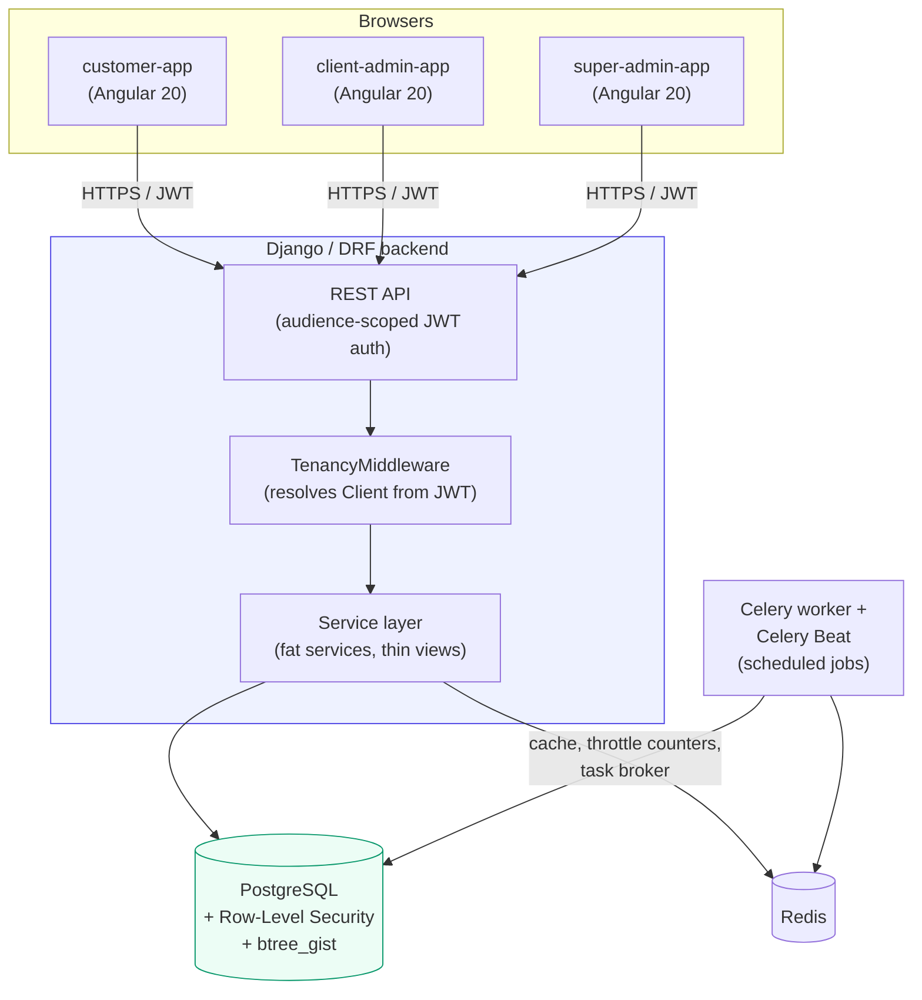
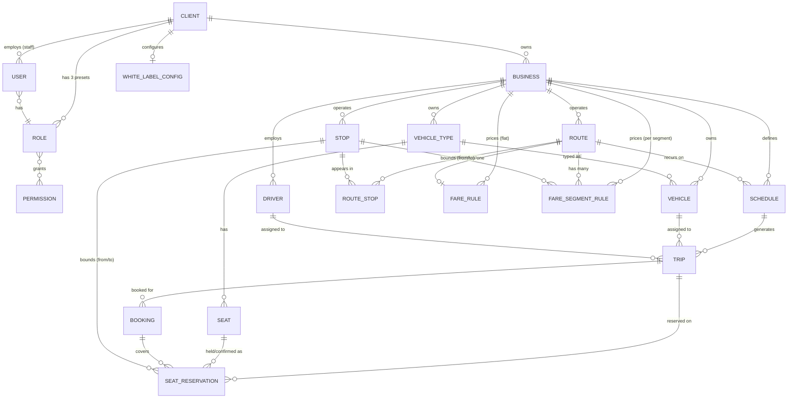

# Integra AFC — Technical Architecture

**Audience**: engineers onboarding to the project, and technical
reviewers (due diligence, security review, new senior hires) assessing
the platform's design.

**Status as of 2026-08-20**: Phases 0–9 complete and independently
self-checked (Phases 0–3) or documented via spec implementation notes
(Phases 4–9) — the full phase plan is done. This document describes
the system as it actually is today, and separately, clearly, what is
planned but not yet built. See §7 for the full built-vs-planned
breakdown, and §8 for known limitations stated plainly rather than
glossed over.

---

## 1. System overview

Integra AFC is an Automated Fare Collection platform for African
transport operators — currently modeled against a Lagos commuter
shuttle, an intercity bus operator, and a Botswana metro system as the
three reference verticals. It is built as **one Django/DRF backend
serving four white-labeled Angular 20 frontends** from a single
monorepo. A dedicated Flutter validator app is still planned for a
later phase (out of scope for everything built so far); `validator-app`
(Phase 4b, §7) is an installable Angular PWA standing in for it in the
meantime, not that future app itself.

The four frontends are not four products — they're four access
surfaces onto the same tenant-scoped backend:

| App | Who uses it | Purpose |
|---|---|---|
| `customer-app` | Passengers | Account, booking (trip search, seat picker, booking confirm, my-bookings — `docs/specs/4-fares-seating-booking-frontend.md`), payment (my-bookings' "Pay now" → real Paystack checkout, Phase 5 frontend Slice A), a `credentials` screen to issue/view/revoke a Tap & Go `TapCredential` (Phase 4b frontend close-out), a ticket/QR view on paid bookings (Phase 6 frontend Slice A), and a `wallet` screen (business picker, balance, top-up) plus "Pay from wallet" on my-bookings (Phase 7 Slice B) — see each phase's own spec implementation note |
| `client-admin-app` | A transport operator's own staff | Manage their Businesses, routes, fleet, schedules, trips, staff, and (Phase 5 frontend Slice B) their own payments/ledger/wallet visibility — a Payments history list, a Ledger overview (business-clearing balance + journal entries), and a passenger Wallet Lookup tool. No settlement-run visibility (platform-staff only) — that, plus Paystack account config, is super-admin-app's own slice (below) |
| `super-admin-app` | Integra's own platform staff | Onboard/vet operators (KYC/KYB review), cross-client oversight, and (Phase 5 frontend Slice C) a cross-client Business search plus per-Business Paystack payout config and settlement-run trigger/history screens |
| `validator-app` | An operator's staff (conductor), tap-and-go trips only | One screen: record a board/alight tap (`docs/specs/4b-tap-and-go.md`). Installable PWA standing in for the still-unbuilt Flutter validator app; signs in via the same client-admin JWT audience as `client-admin-app` |

**Multi-tenancy is the central design constraint.** Each transport
operator is a `Client` (the tenant). A `Client` can run multiple
`Business` entities (e.g. one operator running both a shuttle service
and an intercity route under one company). Every domain model built so
far — routes, stops, vehicles, drivers, schedules, trips — is owned by
a `Business`, and every table enforcing that ownership is protected by
**two independent layers** of isolation (§3), specifically so that a
bug in one layer cannot leak one operator's data into another's view.
This "white-label" positioning means the platform must also resolve
*which* operator a given request belongs to purely from how it was
reached (subdomain/custom domain) — see §3's white-label resolution.

---

## 2. System context (built today)

Everything in this diagram is built and running today via
`docker compose up` (Postgres with `btree_gist` enabled, Redis, the
Django backend, a Celery worker, and Celery Beat). Production AWS
provisioning is documented as an intent but not yet built — see §7.

---

## 3. Multi-tenancy & security model

This is the architectural spine of the platform, and the part a
due-diligence review should scrutinize most closely, since a fare
collection platform's entire trust model rests on one operator never
seeing another's data or money.

### 3.1 Two independent enforcement layers

1. **ORM-level (`TenantScopedManager`)** — every tenant-owned model
   inherits `core.models.BaseModel` (UUID primary key, a `client`
   foreign key, timestamps, soft delete). Its *default* manager
   (`.objects`) automatically filters every query by the active
   Client, read from a request-scoped context variable set by
   `TenancyMiddleware`. There is no "unscoped by default" manager — an
   explicit `.all_objects` manager exists for the narrow, legitimate
   cases that need to bypass scoping (super-admin cross-client review
   queues, system-context code), so any bypass is `grep`-able by name
   and, per this codebase's convention, must be individually justified
   — see §8 for the one open, non-exploitable convention gap this
   caught.
2. **Database-level (Postgres Row-Level Security)** — added in Phase 1
   as defense-in-depth, so that even a bug in the ORM layer above (a
   forgotten filter, a raw SQL query) cannot leak cross-tenant rows —
   the database itself refuses them. Every concrete `BaseModel`
   subclass's first migration applies
   `EnableRowLevelSecurity(model_name)`, which creates a Postgres
   policy scoping every row read/write to
   `current_setting('app.current_client_id')`, with an `OR` clause for
   platform-staff sessions. This is enforced structurally, not by
   convention: a registry-driven test enumerates every concrete
   `BaseModel` subclass via Django's model registry and fails
   automatically if any one skips the RLS migration operation — there
   is no allowlist to fall out of sync.

Full design record: `docs/adr/0002-tenancy-enforcement.md`.

**A real operational detail that matters for anyone connecting to the
database directly**: the application connects as `integra_app`, an
ordinary Postgres role — never as `integra`, the bootstrap/superuser
role, which unconditionally bypasses RLS regardless of
`FORCE ROW LEVEL SECURITY` (Postgres won't let anyone strip
`SUPERUSER` from a bootstrap role). Any direct `psql` access outside
of initial provisioning must use `integra_app`, or RLS will appear
enabled (`pg_class.relrowsecurity` true) while silently enforcing
nothing for that session.

### 3.2 Authentication & authorization

- **JWT, audience-scoped**: three separate token-issuing endpoints
  (`/auth/customer/token/`, `/auth/client-admin/token/`,
  `/auth/super-admin/token/`), so a token issued for one app's
  audience cannot be replayed against another.
- **Platform staff modeling**: one `User` model total (not three
  separate tables) — platform staff have a `NULL` `client` FK and
  `is_platform_staff=True`; tenant staff and passengers have a
  populated `client` FK. `docs/adr/0003` records why a single model
  was chosen over a separate `PlatformStaffUser` table.
- **RBAC**: a real, database-backed `Role → Permission` model (not
  hardcoded role checks in code). Every Client gets three fixed role
  presets at registration (Owner/Manager/Staff); every permission-gated
  endpoint uses one shared `HasPermission(codename)` DRF permission
  class. Custom/editable roles are not built yet (§7).
- **White-label domain resolution**: `GET /white-label/resolve/`
  resolves which Client owns a request purely from the browser's
  `Host` header, called once at app boot
  (`WhiteLabelResolverService`/`provideAppInitializer`) to pre-fill
  login. Production reverse-proxy topology that makes a browser's real
  custom-domain `Host` reach the backend unchanged is documented but
  not yet built — see §7/§8.

### 3.3 Audit trail

Every privileged or state-changing action (KYC/KYB decisions, staff
invitations, white-label changes, fleet/schedule/trip mutations, etc.)
writes an `AuditLog` entry via a single shared
`record_audit_event()` helper. `AuditLog` rows are append-only —
`save()`/`delete()` on an existing row raise an error by design, so the
audit trail cannot be edited after the fact, only appended to.

---

## 4. Data model (built domains)

Every box above is a real, migrated, RLS-protected table today except
`CLIENT` itself (the tenant root — RLS scopes *to* it, so it doesn't
scope *itself*) and `PERMISSION` (platform-wide, not tenant-owned, by
the same reasoning as `ClientInvitation` — see
`docs/specs/1-identity-client-business.md` §2). Full field-level
definitions live in `docs/specs/1-identity-client-business.md`,
`docs/specs/3-network-scheduling-fleet.md`, and
`docs/specs/4-fares-seating-booking.md` — this diagram is a map, not a
substitute for those.

`FareRule`/`FareSegmentRule` (Phase 4 Slice 1) are real, migrated,
RLS-protected tables — a Route uses exactly one of the two, selected at
fare-lookup time by `business.fare_pricing_mode`, never stored
per-Route (hence the "has one" / "has many" distinction above).
`Seat`/`SeatReservation`/`Booking` are real, migrated, RLS-protected
tables — `SeatReservation` is the single table implementing
`docs/adr/0004`'s unified hold/booking concurrency model, enforced by a
Postgres GiST exclusion constraint this diagram can't express (see that
ADR and `docs/specs/4-fares-seating-booking.md` §2 for the mechanism).
`Booking`'s own creation/cancellation flow (Phase 4 Slice 3, done) is
now real too: `POST /bookings/` is the first real consumer of
`apps.core.models.IdempotencyKey` (a passenger's retried request with
the same key returns the original `Booking`, never a second one), and
`POST /bookings/{id}/cancel/` is passenger-only — client-admin staff
can see Bookings (`booking.view`) but not act on them this phase.

**Domain boundaries** (why routes/stops/fleet/schedules are separate
Django apps, not one big app): `apps/network` (Route, Stop, ordered
Route↔Stop), `apps/fleet` (VehicleType, Vehicle, Driver),
`apps/scheduling` (Schedule — a recurrence rule — and Trip — a
concrete, dated occurrence, materialized daily by a Celery Beat job
from active Schedules). This split matches the "one Django app per
bounded domain concept" convention set in `docs/adr/0001` and keeps
each app's service layer owning exactly one concern.

---

## 5. Backend architecture

- **Framework**: Django + Django REST Framework, one project,
  `apps/<domain>/` per bounded concept (`core`, `identity`, `clients`,
  `businesses`, `network`, `fleet`, `scheduling`, `fares`, `seating`,
  `booking`, `tapngo`, `ledger`, `payments`, `wallet` today; `ticketing`
  planned — §7).
- **Convention**: fat services, thin views — business logic lives in a
  service layer (`apps/<domain>/services.py`), views stay thin
  request/response glue. Type hints throughout, checked by `mypy` in
  CI; `ruff` for lint + format.
- **Money**: `Decimal` fields with an explicit currency field, UTC
  storage for all datetimes (`USE_TZ = True`) — first exercised in
  Phase 4 (`FareRule.amount`, `FareSegmentRule.amount`,
  `Booking.total_amount`; currency is read off the owning
  `Business.currency`, never stored redundantly per row). Phase 5
  Slice 1 (`apps/ledger`) added the double-entry ledger every later
  money movement writes through — `LedgerAccount`/`SettlementRun`/
  `JournalEntry`/`JournalLine` per `docs/adr/0006`'s account taxonomy,
  `JournalLine.amount` signed (debit/credit) so `SUM(amount) == 0` per
  entry is the balance invariant, enforced in
  `apps.ledger.services.post_journal_entry()` and independently
  re-verified by a DB-wide sweep test. **Phase 5 Slice 2
  (`apps/payments`) now actually moves money through it**: a
  `charge.success` Paystack webhook atomically posts the three-line
  entry, marks the `Booking` `paid`, and confirms its held seats. The
  commission rate itself (`INTEGRA_COMMISSION_RATE_PERCENT`) is a
  required environment variable with no code-level default — a real
  product/finance decision this codebase deliberately never guesses at.
  **Phase 5 Slice 3 closes the loop**: `apps.ledger.services.claim_settlement_run()`
  atomically creates a `SettlementRun` and bulk-claims every unclaimed
  `JournalEntry` for a Business in one period (the `settlement_run` FK
  assignment is a normal unique write, per ADR-0006, never a
  check-then-write), and `apps.payments.services.trigger_settlement_run()`
  then calls Paystack's Transfer API to actually pay the Business out —
  reconciled via a `transfer.success`/`transfer.failed` extension to the
  same webhook handler Slice 2 built.
- **`core` app**: the shared foundation every domain app builds on —
  `BaseModel`/`TenantScopedManager` (§3), the RLS migration operation,
  `IdempotencyKey` plus the generic hashing/conflict helpers in
  `apps.core.idempotency` (for safe request retries — `POST /bookings/`,
  Phase 4 Slice 3, was the first real consumer; `POST /payments/`,
  Phase 5 Slice 2, is the second), the `AuditLog` write helper, and
  health/readiness endpoints. `apps.core.rls.platform_staff_bypass()` is
  also what every `apps.ledger.services` write path runs under, and
  what the Phase 5 Slice 2 Paystack webhook handler runs under too — a
  single journal entry can legitimately span two different Clients'
  books at once (a Business's clearing account and the platform
  commission account together), and a webhook has no authenticated
  request behind it, so both were never scoped to one tenant to begin
  with. **`platform_staff_bypass()` is now re-entrant** (a
  `ContextVar`-based nesting-depth counter) — Slice 2's webhook handler
  nests it three levels deep (its own call → `post_journal_entry()`'s
  own call → `mark_booking_paid()`'s own call), and the un-guarded
  version silently broke RLS visibility for the rest of an outer bypass
  block once an inner nested call exited, caught live by the webhook
  concurrency spike, not by static review.
- **A documented DRF/tenancy gotcha that recurred and is now a fixed
  convention**: `queryset = Model.objects.all()` declared as a bare
  class attribute on a DRF generic view (or a
  `PrimaryKeyRelatedField(queryset=...)` on a serializer) is evaluated
  once at import time, before any request has set a tenancy context —
  it silently freezes to an empty queryset forever. Both view querysets
  and serializer FK fields backed by `.objects` must be resolved inside
  a method (`get_queryset()`, `validate_<field>()`), never as a class
  body expression. This bit two different slices independently before
  becoming a documented rule (`CLAUDE.md`, `docs/specs/1-...md` §2).

---

## 6. Frontend architecture

- **Angular CLI workspace** (deliberately not Nx — see
  `docs/adr/0001`'s options-considered section), Angular 20, one
  `projects/` directory: 3 application shells + 5 shared libraries.
- **Shared libraries** (each exports only through its own
  `public-api.ts`, consumed via TS path aliases — `@shared-ui`,
  `@shared-data`, `@auth`, `@layout`, `@api-client` — never deep
  relative imports across project boundaries):
  - `shared-ui` — presentational design-system components (buttons,
    text fields, status pills, tables, dialogs).
  - `shared-data` — `ListStore<T, TQuery>`, the base class every
    paginated domain list screen extends (signals-based, handles
    `getAll()`/`updateQuery()`/`changePage()`).
  - `auth` — `AuthStore`, audience-scoped `AuthApiService`,
    `PermissionsService`, the `permissionGuard` route guard, and the
    white-label domain resolver.
  - `layout` — `NavShell`/`AuthLayout` app-shell primitives.
  - `api-client` — a fully-typed REST client generated from the
    backend's OpenAPI schema (`npm run openapi:generate`), with a
    drift check (`openapi:check`) wired into the workflow so the
    frontend's types can never silently diverge from the backend's
    actual contract.
- **Conventions**: standalone components (implicit in v20, no
  `standalone: true` boilerplate), `input()`/`output()` signal
  functions rather than `@Input()`/`@Output()` decorators,
  `ChangeDetectionStrategy.OnPush` on every component, native control
  flow (`@if`/`@for`), reactive forms by default (a small number of
  deliberate, documented exceptions use `ngModel` where a shared
  control has no native `(change)` output), Tailwind CSS first with
  CDK `Dialog`/`BreakpointObserver` for overlays and responsive
  behavior. No NgRx, no Angular Material — verified by grep in every
  phase's self-check, zero exceptions found to date.
- **Permissions in the UI**: a `*appHasPermission` structural directive
  and `permissionGuard` both read the same `/me` permissions array the
  backend RBAC model produces, so frontend visibility and backend
  authorization are driven by one source of truth, not duplicated
  logic.

---

## 7. What's built vs. planned

| Phase | Scope | Status |
|---|---|---|
| **Phase 0 — Foundation** | Monorepo scaffold, Docker Compose, CI, Django tenancy skeleton, audience-scoped JWT auth, Angular workspace (3 apps + shared libs), login→home vertical slice, Playwright + axe | **Complete**, self-checked (`docs/self-check-2026-08-07.md`) |
| **Phase 1 — Identity, Client, Business** | Postgres RLS (defense-in-depth), Client self-registration + KYC, Business + KYB, DB-backed RBAC (Role/Permission/StaffInvitation), white-label config + subdomain resolution | **Complete**, self-checked (`docs/self-check-2026-08-08.md`) |
| **Phase 2 — Client-Admin + Super-Admin UI** | Nav shell, Business management UI, staff management + invite, KYC/KYB review-queue UI, white-label config UI, super-admin client-invitation UI | **Complete**, self-checked (`docs/self-check-2026-08-08-phase2.md`) |
| **Phase 3 — Network, Scheduling, Fleet** | Route/Stop/RouteStop, VehicleType/Vehicle/Driver, Schedule/Trip + the Trip state machine + daily Celery Beat trip-generation job, full `client-admin-app` UI for all 7 models | **Complete**, self-checked (`docs/self-check-2026-08-09-phase3.md`) |
| **Phase 4 — Fares, Seating, Booking** | Fare rules, per-seat layouts, segment-aware seat availability, the booking engine (the revenue path) | **Backend and frontend both complete**, self-checked (`docs/self-check-2026-08-14-phase4-frontend.md`) — `apps/fares`, `apps/seating` (the ADR-0004 concurrency spike, now **Accepted**), `apps/booking`'s creation/cancellation flow, plus the `docs/specs/4-fares-seating-booking-frontend.md` addendum (customer-app booking flow, client-admin bookings-list) and a separately-documented fare-versioning/price-snapshot feature (`docs/specs/4-fares-seating-booking-versioning.md`). 346/346 tests passing. The frontend addendum and the versioning feature were both built without the working agreement's stop-and-review checkpoints and verified retroactively — see the self-check for the full account |
| **Phase 4b — Tap-and-go fare determination** | Board/alight tap recording + segment-fare pricing for non-reservation operators (e.g. Botswana metro), stopping short of payment collection | **Fully complete** — backend, operator harness, customer-app credential UI, and a permanent E2E spec are all built, spec'd at `docs/specs/4b-tap-and-go.md` (see its four Implementation notes) — `apps/tapngo` (`TapCredential`/`FareJourney`/`TapEvent`), identification via QR or NFC through one opaque revocable token, pricing reuses `apps.fares.services.get_fare()` unchanged, one-open-journey-per-passenger enforced by a Postgres partial unique index and proven under real concurrency. 383/383 backend tests passing. The harness shipped as `validator-app`, a fourth installable-PWA Angular app (§2), not the unstyled page originally scoped — verified end to end against the real backend, catching a real CORS gap and a real shared-`ui-button` accessibility bug along the way. The customer-app credential UI needed no backend change — this workspace's first QR-rendering code. The permanent `frontend/e2e/validator-app/` Playwright spec, the last remaining piece, needed a new `playwright.config.ts` entry and a `seed_e2e_users` extension (its own tap-and-go-mode Business, since `booking_mode` is snapshotted per-Trip from the Business's default, plus a `TapCredential` seeded with a known fixed token since the real issuance flow never persists one) — see the spec's own note for 4 pre-existing, unrelated full-suite failures this surfaced, traced to this dev database's already-documented Business-list cruft, not caused by this work |
| **Phase 5 — Payments, Wallet, Ledger** | Payment provider integration, passenger wallets, double-entry ledger, operator payouts | **Backend complete** (all 3 slices, 470/470 backend tests) — `docs/specs/5-payments-wallet-ledger.md`. Slice 1: `apps/ledger` (`LedgerAccount`/`SettlementRun`/`JournalEntry`/`JournalLine` per `docs/adr/0006`'s taxonomy, `post_journal_entry()` as the sole balanced-write path). Slice 2: `apps/payments` (Paystack payment initiation + webhook, per `docs/adr/0007`) and `apps/wallet`, plus `Booking.Status.PAID` — a passenger can now pay for a booking end to end. Slice 3: `claim_settlement_run()`/`trigger_settlement_run()` + a `transfer.success`/`transfer.failed` webhook extension — platform staff can now trigger a real Paystack payout of a Business's accumulated balance. **Frontend complete, all 3 slices** — Slice A (customer-app's "Pay now" flow on `my-bookings`), Slice B (client-admin-app's Payments/Ledger/Wallet Lookup visibility screens, plus a new `ui-stat` shared component), and Slice C (super-admin-app's Business search + Paystack account config + settlement-run trigger/history screens, which needed two small backend additions — `GET /super-admin/businesses/` and a `GET` on the previously PATCH-only Paystack account config endpoint) are all done, see the spec's own implementation notes. **This closes Phase 5's frontend arc.** 480/480 backend tests passing |
| **Phase 6 — Ticketing** | QR ticket issuance, offline validation support | **Complete — backend and both frontend slices** — `docs/specs/6-ticketing.md`. Slice 1: `apps/ticketing`'s `Ticket` model (`OneToOneField` to `SeatReservation`, not `Booking` — a Booking can hold several seats), `signing.py` (this backend's first crypto dependencies, `cbor2`/`pynacl`), `issue_ticket()` wired into `mark_booking_paid()`, 3 `GET` read endpoints. Slice 2: `validate_ticket()` (mirrors `apps.tapngo.services.record_tap()`'s idempotency-first, typed-exception shape), `POST /trips/{id}/tickets/validate/`, new `ticketing.validate` permission. 511/511 backend tests passing (up from 480). Slice 1 surfaced a pre-existing, unrelated defect — every bare, no-default `config()` secret in `config/settings/base.py` looks like it would crash Django settings import under real CI — flagged, not fixed. Slice 2's own mandatory concurrency test caught a real race (two requests under the identical Idempotency-Key could both see the ticket as already-boarded and one would wrongly self-reject instead of recognizing its own replay) — fixed with a race-free second `IdempotencyKey` lookup taken after the row lock. **Frontend Slice A** (customer-app): `my-bookings` gained a "View tickets" action on `paid` rows opening a new `my-bookings/:id/tickets` screen (this workspace's first routed path param) rendering one QR per Ticket via the same `toDataURL()` call `credentials` already established; no backend change needed. 93/93 `customer-app` Karma tests passing (up from 86). **Frontend Slice B** (validator-app): a second screen mirroring `record-tap`'s component/service split exactly, its trip picker filtering to the *opposite* `booking_mode` (`!== 'tap_and_go'`) since only reservation-mode trips produce Tickets, no stop picker needed (a ticket's stop pair is already in the signed payload). Found and closed a real design gap along the way: `AppShell` had no navigation at all (justified when the app had "exactly one screen," no longer true with a second route) — fixed with two plain `routerLink` text links in the existing bespoke header. 31/31 `validator-app` Karma tests passing (up from 20). Verifying both frontend slices live surfaced a real environment gap (not fixed): `docker compose build backend` times out in this sandbox on `pynacl`/`django-celery-beat`'s wheels, so the backend Docker image still predates Phase 6's crypto deps — verified instead via `uv run python manage.py runserver` directly against the running `postgres`/`redis` containers plus real HTTP round-trips (Slice B: a real Ticket boarded, a same-key replay returning the identical result, a different-key replay correctly 409ing). See the spec's own Implementation notes for all three slices |
| **Phase 7 — Passenger Wallet** | Wallet top-up via Paystack, pay-a-booking-from-wallet | **Complete — both slices**, `docs/specs/7-passenger-wallet.md`. Slice A (backend): `PaymentIntent` gained `intent_type` (`booking_payment`/`wallet_topup`) and a `wallet_business` FK (XOR'd against `booking` by a `CheckConstraint`); `initiate_wallet_topup()` mirrors `initiate_payment()`'s idempotency/Paystack shape; `pay_booking_from_wallet()` locks the `Booking` row before checking wallet balance, posts a 3-line ledger entry, and calls `mark_booking_paid()` — a second, independent path to `PAID` alongside the card/webhook path. Its own mandatory concurrency spike (8 threads racing a shared wallet balance; a wallet-pay vs. webhook race for the same booking) found a real bug: `mark_booking_paid()` returned just `Booking`, so callers inferred "did I just pay this?" from `status == PAID` alone — indistinguishable from "a rival path paid it first." Fixed by changing its return type to `tuple[Booking, bool]` (`did_transition`). 470/470 backend tests passing before this phase, up to date after. Slice B (customer-app): a new `wallet` screen (business picker sourced from `GET /routes/browse/`, balance, top-up) and a balance-gated "Pay from wallet" action on `my-bookings`. 117/117 `customer-app` Karma tests passing (up from 107). Live-verified against a real booking and a directly-funded wallet: balance displayed correctly, top-up correctly surfaced Paystack's real 401 (Paystack unreachable in this dev sandbox), pay-from-wallet correctly moved a real ledger balance ₦1000.00 → ₦250.00 matching the booking's exact total |
| **Phase 8 — Seat map generation** | Rows × columns (+ optional aisle) seat-layout generator, closing the "no seat map builder UI at all" gap `PUT /vehicle-types/{id}/seats/` has had since Phase 4 | **Complete — both slices**, `docs/specs/8-seat-map-generation.md`. Slice A: `apps.seating.services.generate_seat_layout()` and `replace_vehicle_type_seats()` changed to take `seats: list[SeatSpec]` and write real `row`/`column` geometry (previously always `null`, despite `customer-app`'s `seat-picker.ts` already being written to render it); new `POST /vehicle-types/{id}/seats/generate/`; a real pre-existing gap fixed — regenerating seats with active `SeatReservation`s used to raise an unhandled 500, now a typed `409 SeatsInUse`. Slice B: a new `client-admin-app` `vehicle-types/:id/seats` screen (client-side-only preview, real write only on submit) and `seat-picker.ts`'s aisle-gap rendering. The aisle model changed mid-Slice-B, by deliberate choice: Slice A's numbering-only aisle (no column gap) couldn't actually drive Edge case §5's gap-rendering mechanism, so it was revised to a physical-layout model where the stored `column` integer jumps by 2 across the aisle — Slice A's own tests were updated to match. A second real bug was found and fixed independent of that: `VehicleTypeSeatsView`/`VehicleTypeSeatsGenerateView` had always been schema-documented as paginated (`DEFAULT_PAGINATION_CLASS` applying to any `GenericAPIView` by default) despite always returning a bare array — invisible until this slice's screen became the first real consumer and the generated frontend types didn't match; fixed with `pagination_class = None` on both views. No model/migration change. 540/540 backend tests, 278/278 `client-admin-app` and 118/118 `customer-app` Karma tests passing, `ng lint`/`ng build` clean on both apps. Live-verified end to end against the real backend, including confirming the real column-gap data via a direct call to the exact endpoint `seat-picker.ts` consumes |
| **Phase 9 — In-app notifications** | A `Notification` model, a scheduled compliance-expiry sweep, an event-driven unused-ticket reminder, and a shared bell-icon UI across all 4 frontends | **Complete — both slices**, `docs/specs/9-notifications.md`. Slice A: new `apps/notifications` app (`Notification`, RLS-protected). Two resolved design questions changed the spec's original draft: (1) the license/insurance/roadworthiness sweep re-nags every `LICENSE_EXPIRY_RENOTIFY_DAYS` (7) days while unresolved and starts a fresh cycle immediately on a renewal, instead of firing once per target ever — needed two new fields (`expiry_snapshot`, `notified_for_date`) and a changed uniqueness constraint; the ticket-unused-reminder sweep keeps the original fire-once design since a Ticket's own status naturally resolves it. (2) A third trigger was added for `super-admin-app`: every platform-staff user is notified the moment a KYC/KYB document is submitted — event-driven, called directly from `apps.clients.services.submit_kyc_document`/`apps.businesses.services.submit_kyb_document`. This surfaced a real modeling question (platform staff have no Client of their own) resolved by keeping `Notification.client` non-nullable but pointing at the *submitting* Client, not the recipient's — which in turn means `GET /notifications/mine/`/`POST .../read/` branch on `request.user.is_platform_staff` (`.objects` vs `.all_objects`), verified safe against RLS's own `client_id = session OR is_platform_staff` policy rather than assumed. Two Celery Beat sweep jobs + two internal-task HTTP endpoints/GitHub Actions cron workflows, mirroring `generate_trips`/`expire_seat_holds`'s exact shape. Slice B: a shared `NotificationBell` (`@layout`) reusing `NavShell`'s own dropdown mechanics (no CDK Overlay exists anywhere in this workspace); a `resolveRoute` per-app customization point resolving three real routing gaps found before building (`customer-app`'s Ticket and `super-admin-app`'s KycDocument/KybDocument only resolve to a general list, no deep link exists for either; `validator-app` gets no resolver at all, mark-read-only). A real bug was found only by opening it in a real browser inside `NavShell`'s narrow sidebar: the dropdown panel rendered off the left edge of the viewport (a `right-0` anchor works fine in the two wide bespoke headers but not the narrow sidebar) — fixed with a new `align` input, verified by screenshot and locked in with a test. 565/565 backend tests passing (up from 540); `layout`/`shared-ui`/all 4 apps' Karma suites green. Live-verified all three trigger types end to end through the real UI, one full round trip per type |
| **Flutter validator app** | Offline-capable ticket validation on operator devices | **Not started.** Explicitly out of scope until its own later phase |

**Every architectural decision this system needed is now "Accepted"**
— none is guessed at, and none was finalized until its open questions
had real, grounded answers rather than placeholders:

- **`docs/adr/0004`** — **Accepted.** Concurrent seat bookings on
  overlapping route segments are made safe by a real, migrated Postgres
  GiST exclusion constraint (`btree_gist`) over an explicit
  `(from_stop, to_stop)` pair plus a derived range column;
  `SeatHold`/`Booking` share one `SeatReservation` lifecycle under that
  same constraint. The mandatory concurrency spike test (6 concurrent
  overlapping requests, exactly one succeeds) exists and passes
  reliably — see this ADR's own Consequences section for a real
  Postgres deadlock behavior the spike test surfaced along the way.
- **`docs/adr/0005`** — **Accepted (2026-08-18).** The QR ticket
  signing scheme: Ed25519 asymmetric signing over a CBOR payload with
  binary-packed UUID fields (kept well under 250 bytes for reliable
  scanning); a `TICKET_SIGNING_KEYS`/`TICKET_SIGNING_ACTIVE_KID`
  env-var pair extending `SECRET_KEY`'s own storage precedent for
  `kid`-based key rotation; and revocation bounded by a short
  `expires_at` plus a best-effort synced revocation list the validator
  caches while offline, rather than a real-time check a genuinely
  offline device can't perform. Gates Phase 6 only — now unblocked.
- **`docs/adr/0006`** — **Accepted (2026-08-14).** The ledger's
  chart-of-accounts shape: wallet/business-clearing/commission/
  PSP-suspense/refund-contra account types, double-entry from day one.
  Its three open questions are resolved in the ADR itself: commission
  split is one balanced three-line journal entry, settlement runs are a
  `SettlementRun` per `(Business, period)` that journal entries point at
  via a nullable FK, and concessions/refunds reuse the existing contra
  accounts rather than a new account type.
- **`docs/adr/0007`** — **Accepted (2026-08-14).** Payment partner:
  Paystack, confirmed with the product owner. Named gap: Paystack
  doesn't operate in Botswana, so the Botswana metro operator needs a
  second PSP (DPO Group is the leading candidate) before it can go live
  on payments specifically — deferred until actually needed, not
  silently assumed away.

Each is a genuine open design question, named in its own ADR along
with what specifically remains to decide — not a placeholder.

---

## 8. Known limitations & deliberate deferrals

Stated plainly, since this is exactly what a technical reviewer should
be checking for:

- **Production reverse-proxy topology for white-labeled custom
  domains** is documented but not built — `GET /white-label/resolve/`
  correctly resolves a Client from `Host` today, but only when
  frontend and backend already share a domain or a reverse proxy
  forwards `Host` unchanged. Local dev has no matching domain, so this
  path 404s harmlessly and login falls back to manual client selection.
- **File storage (KYC/KYB documents) goes to local disk**
  (`MEDIA_ROOT`), not S3 — same "documented but unbuilt" treatment as
  AWS provisioning generally.
- **Django admin sessions authenticate via cookies, not the JWT
  `TenancyMiddleware` reads** — an admin request currently resolves as
  anonymous, so RLS will show zero rows / reject writes for any
  RLS-protected model viewed through `/admin/`. Flagged, not yet fixed,
  for whenever a real model is admin-registered.
- **Platform-staff RBAC is coarse** — `is_platform_staff` remains an
  all-access flag; granular super-admin permissions are worth
  revisiting once Integra has more than a handful of platform staff.
- **Client roles are fixed presets (Owner/Manager/Staff), not
  editable** — a plausible v2 feature, not built.
- **One open, non-exploitable tenancy-convention inconsistency**:
  `apps/scheduling`'s `_cancel_future_trips_for_schedule` uses
  `Trip.all_objects.filter(...)` where `Trip.objects` would be
  sufficient (it always runs in request context on an
  already-tenant-verified `schedule`). Reported, not silently patched,
  per this project's own review discipline for tenancy-adjacent code —
  see `docs/self-check-2026-08-09-phase3.md` Finding #3.
- **No PostGIS / geospatial queries** — `Stop.latitude`/`.longitude`
  are plain `Decimal` fields, not a spatial type; no radius/nearest-stop
  search exists.
- **`Stop` is Business-scoped, not Client-scoped** — a Client running
  two Businesses in the same city cannot yet share one physical stop
  location between them. Revisit only if this becomes a real product
  need.

---

## 9. Engineering process

Every phase and module follows the same discipline, enforced by
working agreement rather than tooling alone:

1. **Spec before code** — every phase/module gets a written spec at
   `docs/specs/<phase>-<module>.md` (scope, data model, API surface,
   edge cases, failure modes, test plan, migration impact) before
   implementation starts.
2. **ADRs for architectural decisions** — including options rejected
   and why, at `docs/adr/`.
3. **Thinnest vertical slice first**, then stop for review.
4. **No guessing on ambiguity** — unavoidable assumptions are labeled
   `ASSUMPTION:` in the deliverable itself, not silently made.
5. **Self-check before declaring anything done** — a fixed checklist
   (`docs/self-check.md`) covering backend tests/coverage, migration
   safety, N+1 queries, tenancy/`all_objects` audit, secrets, rate
   limiting, audit-log completeness, e2e regression, accessibility
   (WCAG AA via axe), and a full visual review pass — run at the end of
   every phase, with a dated report (`docs/self-check-<date>.md`)
   naming every real defect found, whether it was fixed or deliberately
   deferred, and why.
6. **This document stays current** — the built-vs-planned table (§7),
   the ADR appendix, and the data-model diagram (§4) get a small,
   targeted update at the end of every phase/slice, the same way
   `CLAUDE.md`'s own status line already does. Not a separate task to
   remember — part of how "done" is defined from here on.

As of this document, four such reports exist, and every one of them
found and fixed real issues (never zero) — the process is producing
signal, not rubber-stamping.

---

## Appendix — source documents

**Architecture Decision Records** (`docs/adr/`):
[0001](adr/0001-monorepo-structure.md) monorepo structure ·
[0002](adr/0002-tenancy-enforcement.md) tenancy enforcement ·
[0003](adr/0003-primary-key-and-user-model-strategy.md) PK & user model
strategy ·
[0004](adr/0004-seat-segment-concurrency-strategy.md) seat-segment
concurrency (**Accepted**) ·
[0005](adr/0005-qr-ticket-signing-scheme.md) QR ticket signing
(**Accepted**) ·
[0006](adr/0006-ledger-chart-of-accounts.md) ledger chart of accounts
(**Accepted**) ·
[0007](adr/0007-payment-partner-selection.md) payment partner selection
(**Accepted**)

**Specs** (`docs/specs/`):
[Phase 1](specs/1-identity-client-business.md) Identity, Client,
Business ·
[Phase 2](specs/2-client-admin-super-admin-ui.md) Client-Admin +
Super-Admin UI ·
[Phase 3](specs/3-network-scheduling-fleet.md) Network, Scheduling,
Fleet ·
[Phase 4](specs/4-fares-seating-booking.md) Fares, Seating, Booking ·
[Phase 4 frontend addendum](specs/4-fares-seating-booking-frontend.md)
Booking UI ·
[Phase 4 versioning addendum](specs/4-fares-seating-booking-versioning.md)
Fare versioning and price snapshotting ·
[Phase 4b](specs/4b-tap-and-go.md) Tap-and-go fare determination

**Self-check reports**: [Phase 0](self-check-2026-08-07.md) ·
[Phase 1](self-check-2026-08-08.md) ·
[Phase 2](self-check-2026-08-08-phase2.md) ·
[Phase 3](self-check-2026-08-09-phase3.md) ·
[Phase 4 frontend](self-check-2026-08-14-phase4-frontend.md)
